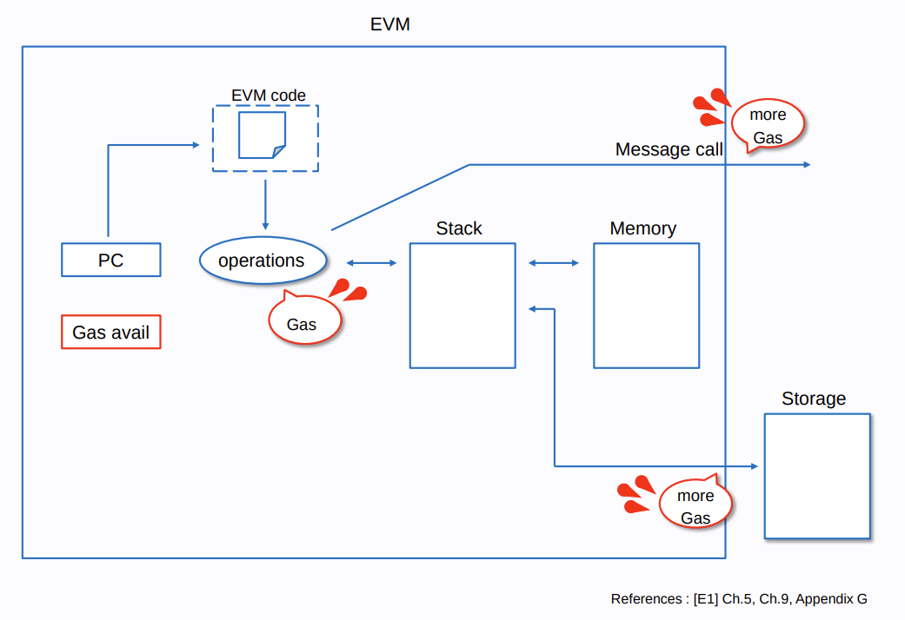
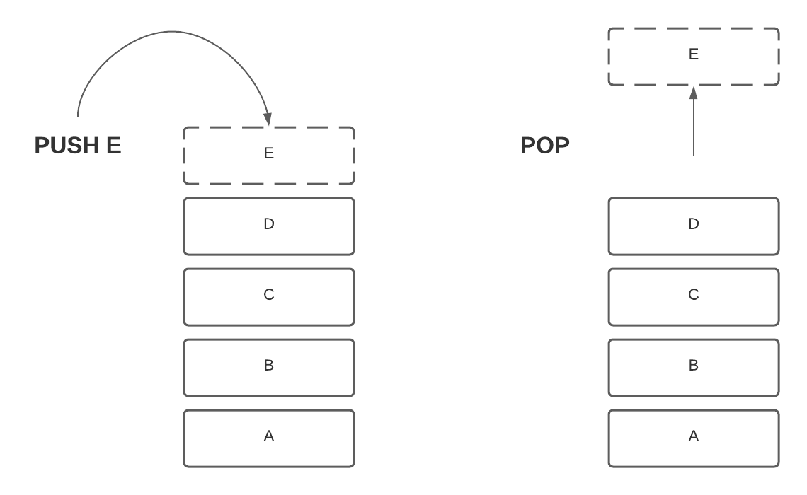
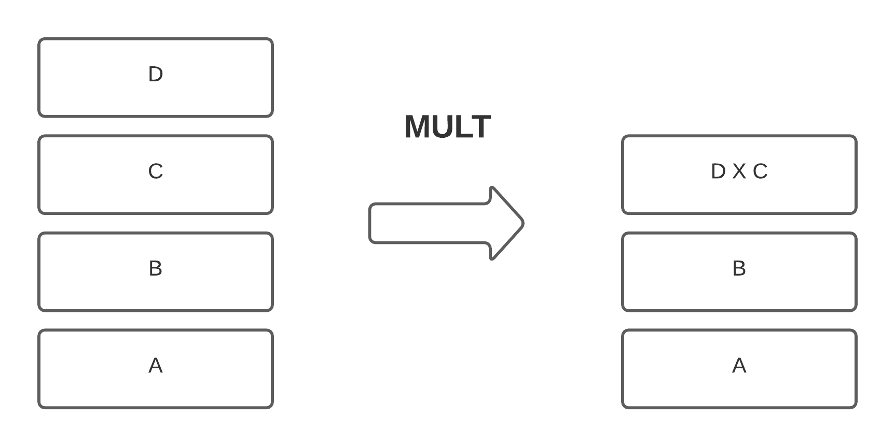
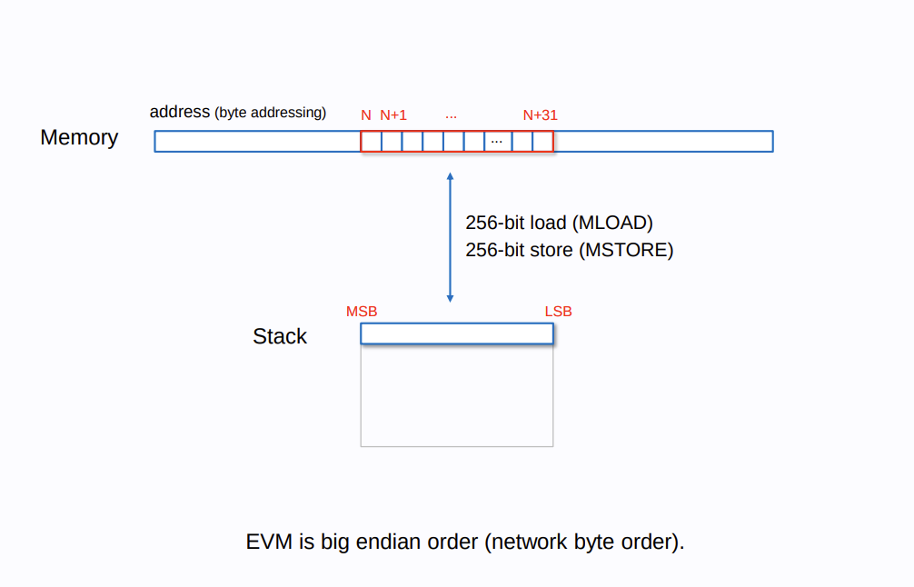
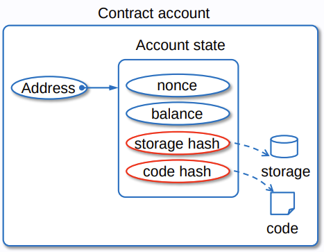

# 理解以太坊虚拟机

[以太坊虚拟机](https://ethereum.org/en/developers/docs/intro-to-ethereum/)（简称 `EVM`）是以太坊背后的大脑。

`EVM` 是以太坊协议的一部分，负责控制智能合约的部署和执行。

它可以比作一台全球去中心化的计算机，拥有数百万个可执行文件（合约），每个文件都有自己的永久数据存储。



## Stack 栈
栈存储当前合约数据，通过 `sstore/sload` 写入/读取合约数据

`EVM` 以堆栈机的形式运行，深度为 `1024` 个项目。

每个 `slot` 都是一个 `256` 位字（`32` 字节），之所以选择这个长度，是因为它兼容 `256` 位加密。

由于 `EVM` 是基于堆栈的虚拟机，因此通常需要将数据 `PUSH` 到堆栈顶部，弹出数据，然后对其顶部的前几个值执行 `ADD` 或 `MUL` 等指令。

堆栈遵循 `LIFO` （后进先出）原则，即最后添加的元素是第一个被移除的元素。


操作码通常会使用堆栈元素作为输入，并且始终取栈顶元素



## Memory/Calldata
在 `EVM` 中，`memory` 可以被认为是一个可扩展的、字节寻址的一维数组。

它初始为空，读取、写入和扩展都需要消耗 `Gas`。

另一方面，`Calldata` 与之类似，但它无法扩展或覆盖。它包含在交易的有效负载中，并作为合约调用的输入。

- 从 `memory` 或 `calldata` 读取将始终访问给定指针后的前 `256` 位（`32` 个字节或 `1` 个字）。
- 存储到`memory` 将始终将字节写入给定指针后的前 `256` 位（`32` 个字节或 `1` 个字）。
- `memory` 和 `calldata` 不是持久的，它们是易失性的——在交易执行完成后，它们就会被遗忘。
- 通过 `mstore/mload` 写入/读取 `memory` 数据



## Storage
以太坊上的所有合约账户都能够将数据持久化地存储在键值存储中。

合约存储的读写成本远高于内存，因为交易执行后，所有以太坊节点都必须相应地更新合约的存储树。




## Transient Storage
[https://soliditylang.org/blog/2024/01/26/transient-storage/](https://soliditylang.org/blog/2024/01/26/transient-storage/) 引入 `key-value` 临时存储的数据，数据只在当前交易环境有效。

[https://eips.ethereum.org/EIPS/eip-1153](https://eips.ethereum.org/EIPS/eip-1153) 提出 `Tload/Tstore` 关键字，用于临时存储数据。
- 在重入防范中使用临时存储代替 `Sstore/Sload` 存储的全局关键字，不涉及 `disk-access`, 节省 `gas`
- `Tstore` 会临时存储数据， `staticCall` 会引起异常

### Solidity Examples
```solidity
// SPDX-License-Identifier: MIT
pragma solidity ^0.8.20;

contract DoubleBufferContract {
    uint256[] bufferA;
    uint256[] bufferB;

    modifier nonreentrant(bytes32 key) {
        assembly {
            if tload(key) {
                revert(0, 0)
            }
            tstore(key, 1)
        }
        _;
        assembly {
            tstore(key, 0)
        }
    }

    bytes32 constant A_LOCK = keccak256("a");
    bytes32 constant B_LOCK = keccak256("b");

    function pushA() public payable nonreentrant(A_LOCK) {
        bufferA.push(msg.value);
    }

    function popA() public nonreentrant(A_LOCK) {
        require(bufferA.length > 0);

        (bool success, ) = msg.sender.call{value: bufferA[bufferA.length - 1]}(
            ""
        );
        require(success);
        bufferA.pop();
    }

    function pushB() public payable nonreentrant(B_LOCK) {
        bufferB.push(msg.value);
    }

    function popB() public nonreentrant(B_LOCK) {
        require(bufferB.length > 0);

        (bool success, ) = msg.sender.call{value: bufferB[bufferB.length - 1]}(
            ""
        );
        require(success);
        bufferB.pop();
    }
}
```

## Reference
[https://ethereum.org/en/developers/docs/intro-to-ethereum/](https://ethereum.org/en/developers/docs/intro-to-ethereum/)

[https://docs.huff.sh/tutorial/overview/#introduction](https://docs.huff.sh/tutorial/overview/#introduction)