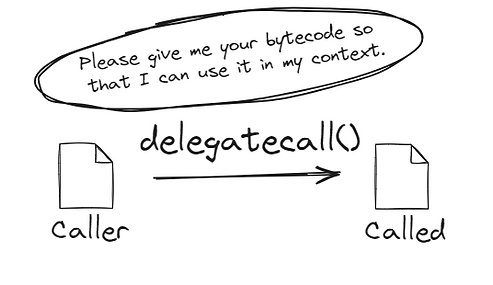

# [合约调用](https://www.rareskills.io/post/delegatecall)
## delegateCall

- `delegateCall` 在底层将外部合约的代码整个复制到当前EVM环境，与 `origin` 交易复用同一个 `EVM` 执行环境
  - `delegateCall` 执行在本合约的 `EVM` 环境 
  - `delegateCall` 拥有完整的外部调用合约的合约代码
  - `delegateCall` 按照外部合约代码去更新/读取 `EVM` 环境中的 `slot` 的状态变量
### 返回状态
- `delegateCall` 返回 `(bool success, bytes memory data)`
  - `boolean` 表明当前调用是否成功
  - `data` 是执行函数返回的数据
  - `delegateCall` 执行失败的话，不会 `revert` 回滚交易，因此需要执行异常判断
- `delegateCall` 外部合约不存在的函数
  - 外部合约存在缺省 `fallback()` ，就执行 `fallback()` 逻辑
  - 不存在缺省函数的话，直接返回 `false`
### Solidity Examples
- `delegateCall` 按照外部合约代码去更新/读取 `EVM` 环境中的 `slot` 的状态变量
- 示例合约在 `EVM` 中的逻辑为： `slot1 += slot0`
- 本合约按照上述逻辑更新自己合约内部的 `slot` 参数
```solidity
// SPDX-License-Identifier: LGPL-3.0-only
pragma solidity >=0.7.0 <0.9.0;

contract Called {
  uint256 base = 3;
  uint256 public number; //slot 1

  function increment() public returns (uint256) {
    number += base; // slot0's value
    return number;
  }
}

contract Caller {
  uint256 base = 99; // 按照业务逻辑会读取slot0数据，参与计算。每次调用：slot1 += slot0(myNumber+=99)
  uint256 public myNumber;
  // there is a new storage variable here
  address public calledAddress = 0xd9145CCE52D386f254917e481eB44e9943F39138;

  function execute(address to, uint256 txGas)
  external
  returns (bool success)
  {
    bytes memory data = abi.encodeWithSignature("increment()");
    return _execute(to, data, txGas);
  }

  function _execute(
    address to,
    bytes memory data,
    uint256 txGas
  ) internal returns (bool success) {
    assembly {
      success := delegatecall(
        txGas,
        to,
        add(data, 0x20),
        mload(data),
        0,
        0
      )
    }
  }

  function delegateCallIncrement(
    address delegatedCalled //28187 gas cost
  ) public returns (uint256) {
    (bool success, bytes memory resdata) = delegatedCalled.delegatecall(
      abi.encodeWithSignature("increment()") //0xd09de08a
    );
    if (!success) {
      assembly {
        revert(add(resdata, 32), mload(resdata))
      }
    } else {
      // 解码call|delegateCall的返回值
      return abi.decode(resdata, (uint256));
    }
  }
}
```
## Immutable|Constant in delegateCall
- `delegateCall` 是将外部合约的代码整个拷贝到当前 `EVM` 执行
- `immutable|constant` 是编码到合约代码存储，并不占据`slot` 存储
- 也就是 `immutable|constant` 类型的数据，是从外部合约代码读取
```solidity
// SPDX-License-Identifier: MIT
pragma solidity ^0.8.26;

contract Caller {
    uint256 private immutable a = 3;

    function getValueDelegate(address called) public returns (uint256) {
        (bool success, bytes memory data) = address(called).delegatecall(
            abi.encodeWithSignature("getValue()")
        );
        if (!success) {
            _revert(data, "Calles_Failure");
        }
        return abi.decode(data, (uint256)); // returns 2
    }

    function _revert(bytes memory returndata, string memory errorMessage)
        private
        pure
    {
        // Look for revert reason and bubble it up if present
        if (returndata.length > 0) {
            // The easiest way to bubble the revert reason is using memory via assembly
            /// @solidity memory-safe-assembly
            assembly {
                let returndata_size := mload(returndata)
                revert(add(32, returndata), returndata_size)
            }
        } else {
            revert(errorMessage);
        }
    }
}

contract Called {
    uint256 private immutable a = 2;

    function getValue() public pure returns (uint256) {
        return a;
    }
}
```
### Call types validation
- `delegateCall`
  - 交易执行在当前的 `EVM` 执行环境
  - `address(this)` = 当前合约的地址
  - `__self` 是 `immutable` 类型数据，因此该值不从 `slot` 读取，而是从外部合约代码读取：读取到的是外部合约的合约地址 
  - 因此，采用 `delegateCall` 的话，两者的地址应该不同
- `call`
  - 交易执行在新的 `EVM` 执行环境
  - `address(this)` = 被调用的外部合约的地址
  - `__self` 是 `immutable` 类型数据，因此该值不从 `slot` 读取，而是从外部合约代码读取：读取到的是外部合约的合约地址
  - 因此，采用 `call` 的话，两者的地址应该相同

总之：
> delegateCall --> require(address(this) != __self)
>
> call --> require(address(this) == __self)
```solidity
    address private immutable __self = address(this);
    /**
     * @dev Check that the execution is being performed through a delegatecall call
     * 要求使用delegateCall调用该修饰器修饰的函数
     * 使用delegateCall调用时：
     ** 1. address(this) = 当前合约的地址
     ** 2. __self是immutable类型数据，从外部合约代码读取，读取到的应该是 外部合约的合约地址
     * 因此，采用 delegateCall的话，两者的地址应该不同
     */
    modifier onlyProxy() {
        require(
            address(this) != __self,
            "Function must be called through delegatecall"
        );
        require(
            _getImplementation() == __self,
            "Function must be called through active proxy"
        );
        _;
    }

    /**
     * @dev Check that the execution is not being performed through a delegate call.
    * 要求使用call调用该修饰器修饰的函数
     * 使用call调用时, 交易被打包进新的EVM 执行环境
     ** 1. address(this) = 外部调用的合约地址
     ** 2. __self是immutable类型数据，从外部合约代码读取，读取到的应该是 外部合约的合约地址
     * 因此，采用 call的话，两者的地址应该相同
     */
    modifier notDelegated() {
        require(
            address(this) == __self,
            "UUPSUpgradeable: must not be called through delegatecall"
        );
        _;
    }
```
