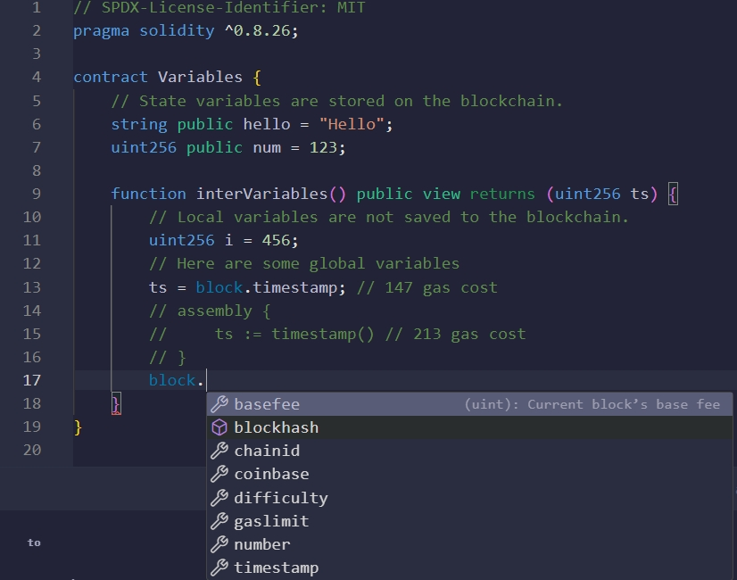

# Data Types
## 数据类型
- `Solidity EVM` 在宽 `256bit` 深 `2^256` 的栈空间存储合约数据
- 数据类型分为定长数值类型和非定长的引用类型

### 数值类型 
**数值类型**赋值时直接传递值： `boolean`，整数型（`uint8~uint256,int8~int256`），`address，bytes（bytes1~bytes32）`
- `boolean` 类型是二值变量， 取值 `true|false，default：false` 
  - 运算符包括： 
  - ！（非） 
  - && （与，短路规则，如果前者false，就不会执行后者） 
  - || （或，短路规则，如果前者true，就不会执行后者） 
  - == （判等） 
  - != （不等）
- `uint/int` 整型,`default: 0`
  - 运算符包括： 
  - 比较运算符，返回`bool (> < >= <= == !=)`
  - 算数运算符`（+ - * / % ** <<  >> ）`
- `address`类型
  - `address` 类型，可以使用payable()修饰，用于接收NativeToken（触发receiver()函数或缺省函数fallback()）
数值类型合约示例：
```solidity
// SPDX-License-Identifier: MIT
pragma solidity ^0.8.26;

contract Static_variables {
    bool public boo = true;

    /*
    uint stands for unsigned integer, meaning non negative integers
    different sizes are available
        uint8   ranges from 0 to 2 ** 8 - 1
        uint16  ranges from 0 to 2 ** 16 - 1
        ...
        uint256 ranges from 0 to 2 ** 256 - 1
    */
    uint8 public u8 = 1;
    uint256 public u256 = 456;
    uint256 public u = 123; // uint is an alias for uint256

    /*
    Negative numbers are allowed for int types.
    Like uint, different ranges are available from int8 to int256
    
    int256 ranges from -2 ** 255 to 2 ** 255 - 1
    int128 ranges from -2 ** 127 to 2 ** 127 - 1
    */
    int8 public i8 = -1;
    int256 public i256 = 456;
    int256 public i = -123; // int is same as int256

    // minimum and maximum of uint
    uint256 public minUInt = type(uint256).min;
    uint256 public maxUInt = type(uint256).max;

    // minimum and maximum of int
    int256 public minInt = type(int256).min;
    int256 public maxInt = type(int256).max;

    address public addr = 0xCA35b7d915458EF540aDe6068dFe2F44E8fa733c;

    /*
    In Solidity, the data type byte represent a sequence of bytes. 
    Solidity presents two type of bytes types :

     - fixed-sized byte arrays
     - dynamically-sized byte arrays.
     
     The term bytes in Solidity represents a dynamic array of bytes. 
     It’s a shorthand for byte[] .
    */
    bytes1 a = 0xb5; //  [10110101]
    bytes1 b = 0x56; //  [01010110]

    // Default values
    // Unassigned variables have a default value
    bool public defaultBoo; // false
    uint256 public defaultUint; // 0
    int256 public defaultInt; // 0
    address public defaultAddr; // 0x0000000000000000000000000000000000000000
    bytes1 public c; //0x00
}
```
### 引用类型
**引用类型**：array[]数组，bytes数组，定长数组，struct结构体，mapping映射
- 数组:动态数组拥有 `push/pop` 内置函数，分别在数组最后增加或删除一个元素
```solidity
// SPDX-License-Identifier: MIT
pragma solidity ^0.8.26;

contract Dynamic_variables_array {
    // Several ways to initialize an array
    uint256[] public indeterminate_arr;
    uint256[] public indeterminate_init_arr = [1, 2, 3];
    // Fixed sized array, all elements initialize to 0
    uint256[10] public determinate_arr;

    function get(uint256 i) public view returns (uint256) {
        return indeterminate_arr[i];
    }

    // Solidity can return the entire array.
    // But this function should be avoided for
    // arrays that can grow indefinitely in length.
    function getArr() public view returns (uint256[] memory) {
        return indeterminate_arr;
    }

    function indeterminate_push(uint256 i) public {
        // Append to array
        // This will increase the array length by 1.
        indeterminate_arr.push(i);
        indeterminate_init_arr.push(i);
    }

    function determinate_push(uint256 index, uint256 i) public {
        // Append to array
        // This will increase the array length by 1.
        determinate_arr[index] = i;
    }

    function indeterminate_pop() public {
        // Remove last element from array
        // This will decrease the array length by 1
        indeterminate_arr.pop();
        indeterminate_init_arr.pop();
    }

    function getLength() public view returns (uint256) {
        return indeterminate_arr.length;
    }

    function remove_not_change_length(uint256 index) public {
        // Delete does not change the array length.
        // It resets the value at index to it's default value,
        // in this case 0
        delete indeterminate_arr[index];
        delete determinate_arr[index];
    }

    // Deleting an element creates a gap in the array.
    // One trick to keep the array compact is to
    // move the last element into the place to delete.
    function remove_change_length(uint256 index) public {
        // Move the last element into the place to delete
        indeterminate_arr[index] = indeterminate_arr[
            indeterminate_arr.length - 1
        ];
        // Remove the last element
        indeterminate_arr.pop();
    }

    function examples_new_determinate_arr() external pure {
        // create array in memory, only fixed size can be created
        uint256[] memory a = new uint256[](5);
        a[0] = 5;
    }
}
```
## 变量作用域
1. 状态变量
- 定义在合约函数函数外，存储在链上的变量
2. 局部变量
- 定义在合约函数内部，仅在函数执行过程中有效的数据，变量生命周期和函数执行周期一致
```solidity
// SPDX-License-Identifier: MIT
pragma solidity ^0.8.26;

contract Variables {
    // State variables are stored on the blockchain.
    string public hello = "Hello";
    uint256 public num = 123;

    function interVariables() public view returns (uint256 ts) {
        // Local variables are not saved to the blockchain.
        uint256 i = 456;
        // Here are some global variables
        ts = block.timestamp; // 147 gas cost
        // assembly {
        //     ts := timestamp() // 213 gas cost
        // }
        {
            // 可以使用合约状态变量/本函数内部的局部变量/区块链上全局变量
            uint interTs = 356;
            interTs += block.timestamp;
            interTs += i;
            interTs += num;
        }
       // interTs +=9; 外部无法访问作用域内部的参数
    }
}
```
3. [全局变量](https://www.evm.codes/?fork=cancun#40)。
- 链上数据，全局变量编码到 `EVM` 字节码中

## 变量修饰符
参数修饰符包括：`public,private,immutable,constant`
- `public`,自动生成 `Getter` 函数，表明函数在合约中可以通过 `abi` 查询
- `private`，参数无法通过 `abi` 直接查询，只能通过自定义的合约函数或 `sload(xx)` 通过 `slot` 获得数据
- `immutable`，参数必须在构造函数中初始化，并且编码在字节码中，后续无法修改
- `constant`，参数在定义时，直接初始化，并且编码在字节码中，后续无法修改
- `payable`,用于修饰地址，表明允许该地址接收 `NativeToken`
## 变量存储方式
参数在合约中的存储方式： `storage(可修改),Bytecodes(constant/immutable,不可修改),(memory,stack,calldata)`

### 合约数据存储
- Bytecodes
  - `immutable|constant` 变量在合约编译时将值存储在合约代码中，因此后续数据变量无法更改
  - 在合约使用期间，无需在内部存储中维护该常量的状态。
```solidity
// SPDX-License-Identifier: MIT
pragma solidity ^0.8.26;

contract Constants {
  // coding convention to uppercase constant variables
  address public constant MY_ADDRESS =
  0x777788889999AaAAbBbbCcccddDdeeeEfFFfCcCc;
  uint256 public constant MY_UINT = 123;
  uint256 private immutable a = 3;
  uint256 public ty; //slot0

  function getslot() public pure returns (uint256 loc) {
    assembly {
      loc := ty.slot
    }
  }
}
```
- Storage
  - 存储合约状态变量，通过写交易修改
### 运行时数据存储
- memory。 函数执行过程中用于存储动态分配的数据，如临时变量、函数参数和函数返回值等
- stack。函数执行过程中存储数据，如基本数据类型和值类型的局部变量
- calldata。 和 `memory` 类似，数据存储在内存中，但是 <kbd>calldata</kbd>数据只读，一般用于函数的输入参数
```solidity
    function fCalldata(uint[] calldata _x) public pure returns(uint[] calldata){
        //参数为calldata数组，不能被修改
        // _x[0] = 0 //这样修改会报错
        return(_x);
    }
```
## 变量引用作用域
1. 普通状态变量 -> 普通状态变量(拷贝)
2. 普通状态变量 -> storage变量(引用)
3. 普通状态变量 -> memory变量(拷贝)
4. storage变量 -> storage变量(引用)
5. storage变量 -> memory变量(拷贝)
6. storage变量 -> 普通状态变量(引用)
7. memory变量 -> memory变量(引用)
8. memory变量 -> 普通状态变量(拷贝)
```solidity
// SPDX-License-Identifier: MIT
pragma solidity ^0.8.26;

contract StateToStateContract {
  uint8[3] public static_array = [1, 2, 3]; //State 状态变量
  uint8[3] public static_array_two;
  uint256[] public dynamic_array;
  event LogUint8(uint8);
  event staticArrays(uint8[3], uint8[3]);
  event dynamicArrays(uint256[], uint256[]);

  function stateToany() public {
    //状态变量 -> 状态变量(拷贝),双方互不影响
    static_array_two = static_array;
    static_array_two[0] = 8;
    emit staticArrays(static_array, static_array_two); //[1,2,3],[8,2,3]
    //状态变量 -> storage变量(引用),引用拷贝，修改任意变量的值会影响另一个状态变量的值，更新合约状态参数
    uint256[] storage tem_dynamic_array = dynamic_array;
    tem_dynamic_array.push(10086);
    emit dynamicArrays(dynamic_array, tem_dynamic_array); //[10086],[10086]
    //状态变量 -> memory变量(拷贝)
    uint256[] memory tem_dynamic_array_two = dynamic_array;
    tem_dynamic_array_two[tem_dynamic_array_two.length - 1] = 999;
    emit dynamicArrays(dynamic_array, tem_dynamic_array_two); //[10086],[999]
  }

  function storageToany() public {
    //storage变量 -> storage变量(引用),引用拷贝，修改任意变量的值会影响另一个状态变量的值，更新合约状态参数
    uint256[] storage tem_dynamic_array = dynamic_array;
    tem_dynamic_array.push(12);
    emit dynamicArrays(dynamic_array, tem_dynamic_array); //[12]，[12]
    uint256[] storage tem_dynamic_array_two = tem_dynamic_array;
    tem_dynamic_array_two.push(13);
    emit dynamicArrays(dynamic_array, tem_dynamic_array); //[12,13],[12,13]
    emit dynamicArrays(tem_dynamic_array, tem_dynamic_array_two); //[12,13],[12,13]
    //storage变量 -> memory变量(拷贝)
    uint256[] memory tem_dynamic_array_memory = tem_dynamic_array;
    tem_dynamic_array_memory[0] = 14;
    emit dynamicArrays(tem_dynamic_array, tem_dynamic_array_memory); //[12,13],[14,13]
    // storage变量 -> 状态变量(引用)，引用拷贝，修改任意变量的值会影响另一个状态变量的值，更新合约状态参数
    dynamic_array = tem_dynamic_array;
    dynamic_array[0] = 15;
    emit dynamicArrays(dynamic_array, tem_dynamic_array); //[15,13],[15,13]
    tem_dynamic_array.push(16);
    emit dynamicArrays(dynamic_array, tem_dynamic_array); //[15,13,16],[15,13,16]
  }

  function memoryToany() public {
    // memory变量 -> 状态变量(拷贝)
    uint8[3] memory tem_static_array = static_array;
    tem_static_array[0] = 4;
    emit staticArrays(static_array, tem_static_array); //[1,2,3],[4,2,3]
    // memory变量 -> memory变量(引用)，引用拷贝，修改任意变量的值会影响另一个状态变量的值，更新合约状态参数
    uint8[3] memory tem_static_array_two = tem_static_array;
    tem_static_array_two[2] = 5;
    emit staticArrays(static_array, tem_static_array); //[1,2,3],[4,2,5]
    emit staticArrays(tem_static_array, tem_static_array_two); //[4,2,5],[4,2,5]
  }
}
```
