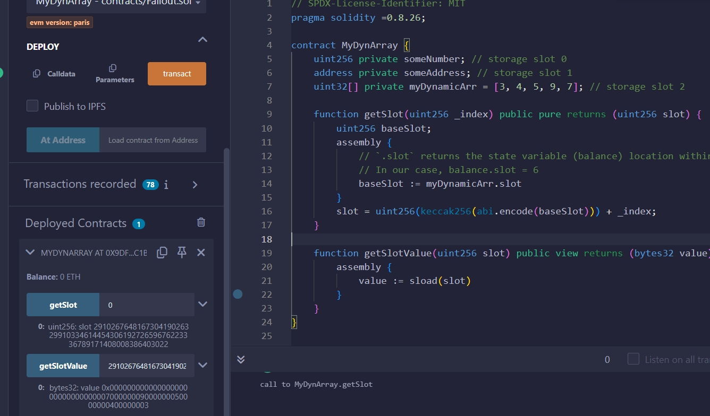

# Solidity参数
## stack slot 存储
1. [slot存储](https://www.rareskills.io/post/solidity-dynamic)
### 数值数据类型占位存储
| Type                   | Bit |  
|------------------------|-----|
| boolean                | 8   | 
| uint8/int8/bytes1      | 8   | 
| uint32/int32/bytes4    | 32  | 
| uint128/int128/bytes16 | 128 | 
| uint256/int256/bytes32 | 256 | 
| address                | 160 |
- `slot` 存储和函数声明顺序相关，不满栈宽 `256bit` 的会高位补到同一个 `slot`
```solidity
contract AddressVariable {
    address owner = 0x5B38Da6a701c568545dCfcB03FcB875f56beddC4;
    // new
    bool Boolean = true;
    uint32 thirdvar;
}
```
- 其中，`owner` 占位 `160 bit`, `Boolean` 占位 `8 bit`, `thirdvar` 占位 `32 bit`
- 三个变量按照证明顺序，高位编码到同一个slot存储
- 此时，`slot` 剩余 `56 bit`，下个声明变量的类型如果超出 `56 bit`，会顺延到 下一个 `slot` 存储

```solidity
contract AddressVariable {
    address owner = 0x5B38Da6a701c568545dCfcB03FcB875f56beddC4;
    bool Boolean = true;
    uint32 thirdVar;
    // new
    address admin = 0xAb8483F64d9C6d1EcF9b849Ae677dD3315835cb2;
}
```

## 动态数据类型存储
### Mapping数据存储
```solidity
// SPDX-License-Identifier: MIT
pragma solidity =0.8.26;

contract MyMapping {
  uint256 a; // storage slot 0
  uint256 b; // storage slot 1
  uint256 c; // storage slot 2
  uint256 d; // storage slot 3
  uint256 e; // storage slot 4
  uint256 f; // storage slot 5
  mapping(address => uint256) private balance; // storage slot 6
  mapping(string => uint256) private strbalance; // storage slot 6

  constructor() {
    strbalance["aaa"] = 9; // RED
    balance[address(0x1)] = 7;
  }

  //*** NEWLY ADDED FUNCTION ***//
  function getStorageSlot(address _key)
  public
  pure
  returns (uint256 balanceMappingSlot, bytes32 slot)
  {
    assembly {
    // `.slot` returns the state variable (balance) location within the storage slots.
    // In our case, balance.slot = 6
      balanceMappingSlot := balance.slot
    }

    slot = keccak256(
      abi.encode(
        bytes32(abi.encode(_key)),
        bytes32(abi.encode(balanceMappingSlot))
      )
    );
  }

  function getValue(address _key)
  public
  view
  returns (bytes32 slot, uint256 value)
  {
    // CALL HELPER FUNCTION TO GET SLOT

    (, slot) = getStorageSlot(_key);

    assembly {
    // Loads the value stored in the slot
      value := sload(slot)
    }
  }

  //*** NEWLY ADDED FUNCTION ***//
  function getStringStorageSlot(string memory key)
  public
  pure
  returns (uint256 balanceMappingSlot, bytes32 slot)
  {
    assembly {
    // `.slot` returns the state variable (strbalance) location within the storage slots.
      balanceMappingSlot := strbalance.slot
    }
    slot = keccak256(
      abi.encodePacked(
        abi.encodePacked(key),
        bytes32(abi.encode(balanceMappingSlot))
      )
    );
  }

  function getStringValue(string memory _key)
  public
  view
  returns (bytes32 slot, uint256 value)
  {
    // CALL HELPER FUNCTION TO GET SLOT

    (, slot) = getStringStorageSlot(_key);

    assembly {
    // Loads the value stored in the slot
      value := sload(slot)
    }
  }
}
```
- Mapping[key] = value
- `Mapping value` 数据存储位置和 声明顺序(`baseSlot`)以及 `key` 值相关
  - 聚合 `bytes32(Key)` 和 `bytes32(baseSlot)`


### 嵌套Mapping数据存储
- Mapping(key=>Mapping(...)
- 多重嵌套mapping的slot存储规则：每层的key作为下层的baseSlot值参与计算


```solidity
// SPDX-License-Identifier: MIT
pragma solidity =0.8.26;

contract MyNestedMapping {
    uint256 a; // storage slot 0
    uint256 b; // storage slot 1
    uint256 c; // storage slot 2
    uint256 d; // storage slot 3
    uint256 e; // storage slot 4
    uint256 f; // storage slot 5
    mapping(address => mapping(uint256 => uint256)) public balance; // storage slot 6

    constructor() {
        balance[0x5B38Da6a701c568545dCfcB03FcB875f56beddC4][123] = 9; // RED
    }

    //*** NEWLY ADDED FUNCTION ***//
    function getStorageSlot(address key1, uint256 key2)
        public
        pure
        returns (uint256 balanceMappingSlot, bytes32 slot)
    {
        assembly {
            // `.slot` returns the state variable (balance) location within the storage slots.
            // In our case, balance.slot = 6
            balanceMappingSlot := balance.slot
        }

        bytes32 slot1 = keccak256(
            abi.encode(
                bytes32(abi.encode(key1)),
                bytes32(abi.encode(balanceMappingSlot))
            )
        );
        slot = keccak256(abi.encode(bytes32(abi.encode(key2)), slot1));
    }

    function getValue(address key1, uint256 key2)
        public
        view
        returns (bytes32 slot, uint256 value)
    {
        // CALL HELPER FUNCTION TO GET SLOT

        (, slot) = getStorageSlot(key1, key2);

        assembly {
            // Loads the value stored in the slot
            value := sload(slot)
        }
    }

    function convert(string memory key) internal pure returns (bytes32 ret) {
        require(bytes(key).length <= 32);

        assembly {
            ret := mload(add(key, 32))
        }
    }
}
```
### Arrays数据存储
#### 定长数组
- 定长数组作为固定大小的参数
- 数据存储按照静态类型依次 `slot` 存储
- 定长数组不和其他参数共享 `slot`
```solidity
// SPDX-License-Identifier: MIT
pragma solidity =0.8.26;

contract MyFixedUint256Array {
    uint256 num; // storage slot 0

    uint64[3] myArr = [
        4, // storage slot 1
        9, // storage slot 1
        2 // storage slot 1
    ];
    uint64 next = 5; //storage slot 2
    uint128[3] bigArr = [
        4, // storage slot 3
        9, // storage slot 3
        2 // storage slot 4
    ];
    uint64 bnext = 5; //storage slot 5

    function getValue(uint256 index) public view returns (uint256 value) {
        // CALL HELPER FUNCTION TO GET SLOT
        assembly {
            // Loads the value stored in the slot
            value := sload(index)
        }
    }
}
```
#### 不定长数组--arrays[]
- 不定长数据在合约编译时无法确认数据 `size`，所以在 `baseSlot` 存储当前参数的 `size`
- 不定长数组具体数据的起始位置和 `baseSlot` 相关：`keccak256（baseSlot）`
- 不定长数组的数据依次从起始位置开始入栈存储
- 不定长数组的数据按照数值类型继续存储，`slot` 进行高位补足存储数组参数
- 数值长度超出 `256bit` 后，顺延至下一个 `slot` 存储 `（index += 1）`
```solidity
// SPDX-License-Identifier: MIT
pragma solidity =0.8.26;

contract MyDynArray {
  uint256 private someNumber; // storage slot 0
  address private someAddress; // storage slot 1
  uint32[] private myDynamicArr = [3, 4, 5, 9, 7]; // storage slot 2

  function getSlot(uint256 _index) public pure returns (uint256 slot) {
    uint256 baseSlot;
    assembly {
    // `.slot` returns the state variable (balance) location within the storage slots.
    // In our case, balance.slot = 6
      baseSlot := myDynamicArr.slot
    }
    slot = uint256(keccak256(abi.encode(baseSlot))) + _index;
  }

  function getSlotValue(uint256 slot) public view returns (bytes32 value) {
    assembly {
      value := sload(slot)
    }
  }
}
```

- 数据类型变成 `uint64[] private myDynamicArr = [3, 4, 5, 9, 7]; // storage slot 2`:
  - 一个 `slot` 最多存储 `4` 个数组参数
  - 因此，起始位置 `index=0` 的 `slot` 能够存储 `3,4,5,9` 四个参数
  - 剩余参数顺眼至下一个 `slot`
  - 因此，起始位置 `index=1` 的 `slot` 存储 `7`
#### 多维不定长数组
- array[][]... `uint64[][] private nestedDynamicArray = [[2, 9, 6, 3, 2], [7, 4, 8, 10, 2]]; `
- `baseSlot` 存储当前数组大小,示例大小为 `2`
- 进一步确认内部嵌套的数组大小，存储内部数组大小的 `slot_array_size` 和 数组 `index` 相关：`slot_array_size = keccak256（baseSlot）+ index`
- 嵌套数组内部的数据 `slot_array_data_loc` 和 `slot_array_size` 以及内部 `internal_index` 相关：`slot_array_data_loc = keccak256（slot_array_size）+ internal_index`
- 嵌套数组内部的数据存储按照单维存储规则
```solidity
// SPDX-License-Identifier: MIT
pragma solidity =0.8.26;

contract MyNestedArray {
  uint256 private someNumber; // storage slot 0

  // Initialize nested array
  uint64[][] private nestedDynamicArray = [[2, 9, 6, 3, 2], [7, 4, 8, 10, 2]]; // storage slot 1

  function getArrSizeLoc_BaseSlot_Index(uint256 index)
  public
  pure
  returns (uint256 slot)
  {
    uint256 baseSlot;
    for (uint256 i; i <= index; i++) {
      if (i == 0) {
        assembly {
        // `.slot` returns the state variable (balance) location within the storage slots.
        // In our case, balance.slot = 6
          baseSlot := nestedDynamicArray.slot
        }
      }
      slot = uint256(keccak256(abi.encode(baseSlot))) + index;
    }
  }

  function getArrDataLoc_SlotLoc_InternalIndex(uint256 locslot, uint256 index)
  public
  pure
  returns (uint256 slot)
  {
    slot = uint256(keccak256(abi.encode(locslot))) + index;
  }

  function getSlot(
    uint256 baseSlot,
    uint256 _index1,
    uint256 _index2
  ) public pure returns (bytes32 _finalSlot) {
    // keccak256(baseSlot) + _index1
    uint256 _initialSlot = uint256(keccak256(abi.encode(baseSlot))) +
          _index1;

    // keccak256(_initialSlot) + _index2
    _finalSlot = bytes32(
      uint256(keccak256(abi.encode(_initialSlot))) + _index2
    );
  }

  function getSlotValue(uint256 _slot) public view returns (uint256 value) {
    assembly {
      value := sload(_slot)
    }
  }

  function addArray() external {
    nestedDynamicArray.push([22, 6, 99, 14]);
  }
}
```
数据：[[2, 9, 6, 3, 2], [7, 4, 8, 10, 2]]，Array[array1,array2]
#### 动态数据类型存储
| 说明                       | slot                                                                                        | Value                                                               |
|--------------------------|---------------------------------------------------------------------------------------------|---------------------------------------------------------------------|
| baseSlot                 | 1                                                                                           | 2                                                                   |
| array1<br/>存储size的slot,s1     | keccack(1)+0=<br/>80084422859880547211683076133703299733277748156566366325829078699459944778998  | 5                                                                   |
| array2<br/>存储size的slot,s2     | keccack(1)+1=<br/>80084422859880547211683076133703299733277748156566366325829078699459944778999  | 5                                                                   |
| array1<br/>存储index0的数据slot,d1 | keccack(s1)+0=<br/>82253526175936117417672031222849803842933200219522072251142807856800200228130 | 0x0000000000000003000000000000000600000000000000090000000000000002  |
| array1<br/>存储index1的数据slot,d2 | keccack(s1)+1=<br/>82253526175936117417672031222849803842933200219522072251142807856800200228131 | 0x0000000000000000000000000000000000000000000000000000000000000002  |
| array2<br/>存储index0的数据slot,d3 | keccack(s2)+0=<br/>106053296617608346790393806727882046642653284128270527600775845709961105489201 |0x000000000000000a000000000000000800000000000000040000000000000007|
| array2<br/>存储index1的数据slot,d4 | keccack(s2)+1=<br/>106053296617608346790393806727882046642653284128270527600775845709961105489202 |0x0000000000000000000000000000000000000000000000000000000000000002|

### String
- string 作为动态类型:
  - 短 `string(<31bytes),baseSlot` 存储 `string以及size（len(string) * 2）`,string中每个字符占据两位
  - 短string,string data编码在高位，size编码在低位

  - 长 `string(>31bytes)`, `baseSlot` 仅存储 `size(len(string) * 2 + 1）`
  - 长 `string data` 存储的起始 `slot = keccak256(baseSlot)`,依次顺延存储

#### size
- 长/短 string 的size计算方式不同的原因在于让字节码更好的区分string的长短
- 短 string 的size  = len(string)*2 表示偶数，因此最后一位一定是0
- 长 string 的size = len(string)*2+1 表示奇数，最后一位一定是1
```solidity
// SPDX-License-Identifier: MIT
pragma solidity =0.8.26;

contract ModMethod {
    // Gas cost: 326
    function isEvenMod(uint256 num) public pure returns (bool x) {
        x = (num % 2) == 0;
    }

    // Gas cost: 272
    function isEvenAnd(uint256 num) public pure returns (bool x) {
        x = (num & 1) == 0;
    }
}
```
- string作为动态数据，可能存储非ascII值，因此通过bytes计算长度
```solidity
// SPDX-License-Identifier: MIT
pragma solidity =0.8.26;

contract StringLen {
    string str1 = "Hello World";
    string str2 = unicode"酱香拿铁"; // ecah charactor occupy 3 bytes

    function lenth() public view returns (uint256 str1len, uint256 str2len) {
        str1len = bytes(str1).length;
        str2len = bytes(str2).length;
    }
}
```
### Bytes
- bytes动态数组slot存储规则和string一致
- bytes0x 固定大小数组 和 array 固定数组存储规则一致
### Struct
- 结构体内部数据直接从baseSlot依次按照类型存储

## Slot 存储读取
- `sload`读取当前slot位置的value
- `sstore`更新当前slot位置的value,
- `sload` 和 `sstore` 将参数全部作为 bytes32处理，更节省gasFee
- `.slot` 返回当前参数的baseSlot
### 读取slot数据
```solidity
// SPDX-License-Identifier: MIT
pragma solidity =0.8.26;

contract slotLoc {
  uint256 private someNumber = 5; // storage slot 0
  struct Payment {
    address payee;
    uint128 payId;
    uint256 payPrice;
  }
  Payment private payment =
  Payment(
    address(0x1), // storage slot 1
    12345, // storage slot 2
    22 // storage slot 3
  );
  address private someAddress = address(0x2); // storage slot 4
  uint32[] private myDynamicArr = [3, 4, 5, 9, 7]; // storage slot 5

  function getSlot()
  public
  pure
  returns (
    uint256 numslot,
    uint256 paymentslot,
    uint256 addressslot
  )
  {
    assembly {
    // `.slot` returns the state variable (balance) location within the storage slots.
    // In our case, balance.slot = 6
      numslot := someNumber.slot
      paymentslot := payment.slot
      addressslot := someAddress.slot
    }
  }

  function getSlotValue(uint256 slot) public view returns (bytes32 value) {
    assembly {
      value := sload(slot)
    }
  }

  function sstore_x(uint256 newval) public {
    assembly {
      sstore(someNumber.slot, newval)
    }
  }
}
```
