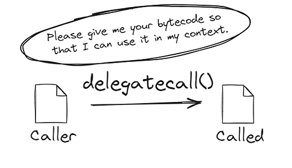
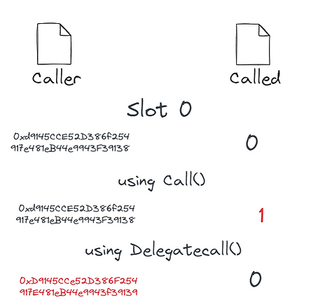

# [合约调用](https://www.rareskills.io/post/delegatecall)
EVM合约之间可以通过字节码：Call,delegateCall,staticCall互相调用
## Call

- call 的调用在底层新启一个EVM作为call交易的执行环境，用于更新被调用的合约的状态变量
- 对于被call调用的合约来讲，这是一笔新的交易，交易的发起方就是发起调用的合约地址
- 被call的合约函数必须被 public|external修饰，internal|private不支持外部调用
- 函数可以通过接口调用，<kbd>_Name(_Address).func()</kbd>
- 函数可以通过选择器调用abi.encodeWithSignature | encodeWithSelector | encodePacked，直接传参调用合约函数选择器进行调用
- call返回 `(bool success, bytes memory data)`
  - boolean表明当前调用是否成功
  - data是执行函数返回的数据
  - call执行失败的话，不会回滚交易，因此需要执行异常判断
- call 不存在的函数，会返回 false
```solidity
// SPDX-License-Identifier: MIT
pragma solidity ^0.8.26;

interface CalledInterface {
   function increment(uint256 num) external;
}

contract Called is CalledInterface {
   uint256 public number;

   function increment(uint256 num) external {
      number += num;
   }
}

contract Caller {
   function callIncrement(CalledInterface calledAddress, uint256 num)
   external
   {
      calledAddress.increment(num);
   }

   function callIncrementSig(CalledInterface calledAddress, uint256 num)
   external
   {
      (bool flag, bytes memory result) = address(calledAddress).call(
         abi.encodeWithSignature("increment(uint256)", num)
      );
      if (!flag) {
         assembly {
            revert(add(result, 32), mload(result))
         }
      }
   }

   function callIncrementSelector(CalledInterface calledAddress, uint256 num)
   external
   {
      bytes4 mSelector = bytes4(keccak256("increment(uint256)"));
      (bool flag, bytes memory result) = address(calledAddress).call(
         abi.encodePacked(mSelector, num)
      //   abi.encodeWithSelector(mSelector, num)
      // abi.encodeWithSelector(CalledInterface.increment.selector, num)
      );
      if (!flag) {
         assembly {
            revert(add(result, 32), mload(result))
         }
      }
   }
}
```
## delegateCall

- delegateCall 的调用在底层复用一个EVM执行环境
- EVM执行环境把被 delegateCall 的合约代码整个复制到当前EVM环境
- delegateCall 按照被调用合约的合约代码去更新/读取当前合约对应 slot 的状态变量
- 被 delegateCall 的合约函数必须被 public|external修饰，internal|private不支持外部调用
- delegateCall 一个空合约地址（EOA地址）并不会报错，call|delegate 的报错原因：
  - 执行中遇到 REVERT 关键字
  - out-of-gas
  - 异常(/0，out-of-bound)
### [slot Value](https://yuhuajing.github.io/ethernaut-book/04-Telephone/Telephone.html)
合约按照被调用合约的slot更新逻辑来更新自己合约的状态变量
```solidity
// SPDX-License-Identifier: LGPL-3.0-only
pragma solidity >=0.7.0 <0.9.0;

contract Enum {
  enum Operation {
    Call,
    DelegateCall
  }
}

/// @title Executor - A contract that can execute transactions
/// @author Richard Meissner - <richard@gnosis.pm>
contract Executor {
  function execute(
    address to,
    uint256 value,
    bytes memory data,
    Enum.Operation operation,
    uint256 txGas
  ) external returns (bool success) {
    if (operation == Enum.Operation.DelegateCall) {
      // solhint-disable-next-line no-inline-assembly
      assembly {
        success := delegatecall(
          txGas,
          to,
          add(data, 0x20),
          mload(data),
          0,
          0
        )
      }
    } else {
      // solhint-disable-next-line no-inline-assembly
      assembly {
        success := call(
          txGas,
          to,
          value,
          add(data, 0x20),
          mload(data),
          0,
          0
        )
      }
    }
  }
}

contract Called {
  uint256 base = 3;
  uint256 public number; //slot 1

  function increment() public returns(uint256) {
    number += base; // slot0's value
    return number;
  }
}

contract Caller is Executor {
  uint256 base = 99; // 按照业务逻辑会读取slot0数据，参与计算。每次调用：slot1 += slot0(myNumber+=99)
  uint256 public myNumber;
  // there is a new storage variable here
  address public calledAddress = 0xd9145CCE52D386f254917e481eB44e9943F39138;

  function delegateCallIncrement(
    address delegatedCalled //25833 gas cost
  ) public returns(uint256){
    (bool success, bytes memory resdata) = delegatedCalled.delegatecall(
      abi.encodeWithSignature("increment()") //0xd09de08a 
    );
    if (!success) {
      assembly {
        revert(add(resdata, 32), mload(resdata))
      }
    }else{
      // 解码call|delegateCall的返回值
      return abi.decode(resdata, (uint256));
    }
  }
}
```
Caller合约更换slot0参数的话,仍然会按照被调用者的逻辑`slot0+=1` 更新自己合约内部的slot参数

### constant/immutable 参数
- delegateCall 是把被调用者的整个代码拷贝到自己的EVM环境执行
- constant/immutable 参数不存储在合约slot,而是编码到合约codes
- 因此，delegateCall 仍然读取被调用者的 constant。immutable 类型的参数
```solidity
// SPDX-License-Identifier: LGPL-3.0-only
pragma solidity >=0.7.0 <0.9.0;

contract Caller {
    uint256 private immutable a = 3;

    function getValueDelegate(address called) public returns (uint256) {
        (bool success, bytes memory data) = called.delegatecall(
            abi.encodeWithSignature("getValue()")
        );
        if (!success) {
            assembly {
                revert(add(data, 32), mload(data))
            }
        } else {
            // 解码call|delegateCall的返回值
            return abi.decode(data, (uint256));
        } // It's 2
    }
}

contract Called {
    uint256 private immutable a = 2;

    function getValue() public pure returns (uint256) {
        return a;
    }
}
```
## [staticCall](https://www.rareskills.io/post/solidity-staticcall)
1. 和Call一样，但是只能用于读取数据，无法更新slot数值
2. 天然适用于使用 [预编译合约](./contracts-precompile.md)
