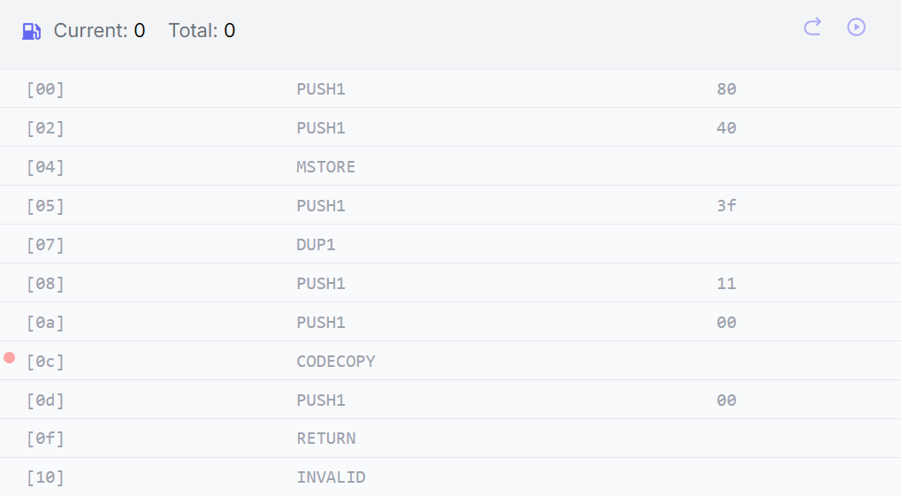

# [contract-creation](https://www.rareskills.io/post/ethereum-contract-creation-code)
## 读取内存数据
[codecopy](https://www.evm.codes/?fork=cancun#39) 从内存中取出数据
- `destOffset`: 内存中读取数据的起始位置
- `offset`: 待拷贝数据的起始位置
- `size`: 拷贝数据的长度

## Introduction-creation code
-  合约编译成两部分: `<initCode> + <Runtimecode>(part1_runtimeCode + part2_Metadata)`
### Miniature Contract Examples
```solidity
// SPDX-License-Identifier: MIT
pragma solidity ^0.8.17; // optimizer: 200 runs

contract Minimal {
  // 空 constructor()函数不影响合约部署的字节码，存在或不存在 constructor()函数，字节码都一样
  constructor() payable {}
}
```
编译后的字节码：
`0x6080604052603f8060116000396000f3fe` + `6080604052600080fdfea2646970667358221220a4c95008952415576a18240f5049a47507e1658565a8ec11a634c25a9aa17cf164736f6c63430008110033`
### initCode

- `initcode` 执行 `codecopy`,栈内数据自栈顶向下依次存在值：`00,11,3f,3f`
  - 从内存 `0index` 开始，间隔 `0x11=17` 开始,跳过 `initCode` 部分，读取 `runtimeCode` 的`0x3f=63bytes` 数据
- `return` 返回内存数据，除 `initCode` 部分的值，作为合约数据存储上链
#### payable|Non-payable constructor()
- `payable` 修饰的构造函数下的 `initCode`：`0x6080604052603f8060116000396000f3fe`
- `Non-payable` 修饰的构造函数下的 `initCode`： `0x6080604052348015600f57600080fd5b50603f80601d6000396000f3fe`
  - `Non-payable` 的 `initCode` 更大
  - 构造函数需要执行 `msg.value` 的判断: `348015600f57600080fd5b50 (12 bytes)`
  - `<initCode> +  <extra 12 byte sequence (payable case)>`
#### Non-payable evm codes
```solidity
// check the amount of wei that was sent
CALLVALUE
DUP1
ISZERO

// Jump to 0x0f (contract deployment step)
PUSH1 0x0f
JUMPI

// revert if wei sent is greater than 0
PUSH1 0x00
DUP1
REVERT
```
### RuntimeCode
- `RuntimeCode` 由两部分组成： `<Runtimecode>(part1_runtimeCode + part2_Metadata)`
  - `part1_runtimeCode` 存储真正的合约逻辑代码，进行函数选择器的匹配和处理
  - `part2_Metadata` 由两部分组成：当前合约编译环境等源数据 + 构造函数传参
- 在空合约中，`part1_runtimeCode` 为空，但是 `part2_Metadata` 源数据不为空
#### Constructor without parameters
```solidity
pragma solidity 0.8.17;
contract Runtime {
    address lastSender;
    constructor () payable {}

    receive() external payable {
        lastSender = msg.sender;
    }
}
```
编译后的字节码：`<initCode> + <Runtimecode>(part1_runtimeCode + part2_Metadata)`

>part1_runtimeCode := 0x608060405236601c57600080546001600160a01b03191633179055005b600080fdfe
>
>part2_Metadata := 0xa2646970667358221220e9b731ab28726d97cbf5219f1e5eaec508f23254c60b15ed1d3456572547c5bf64736f6c63430008070033a2646970667358221220e9b731ab28726d97cbf5219f1e5eaec508f23254c60b15ed1d3456572547c5bf64736f6c63430008070033
- part1_runtimeCode
  - `msg.data != ""`, 由于不存在 `fallback()` 函数，直接 `revert`
  - `msg.value != ""`, 由于存在 `receive()` 函数，直接跳转到 `receive` 函数执行逻辑
#### Constructor with parameters
```solidity
// SPDX-License-Identifier: MIT
pragma solidity ^0.8.17; // optimizer: 200 runs

contract Minimal {
  // optimizer: 200contract MinimalLogic {
  uint256 private x;
  constructor(uint256 _x) payable {
    x = _x;
  }
}
```
编译后的字节码：`<initCode> + <Runtimecode>(part1_runtimeCode + part2_Metadata)`
>"Init code": 0x608060405260405160893803806089833981016040819052601e916025565b600055603d565b600060208284031215603657600080fd5b5051919050565b603f80604a6000396000f3fe"Runtime code (metadata only)": 0x6080604052600080fdfea26469706673582212204a131c1478e0e7bb29267fd8f6d38a660b40a25888982bd6618b720d4498b6b464736f6c63430008070033"Constructor arguments":0000000000000000000000000000000000000000000000000000000000000001
- initCode
  - 构造函数需要一个 `address` 类型的传参，传参无效的话，直接 `revert`
  - 初始化传参变量
- part1_runtimeCode
  - `msg.data != ""`, 由于不存在 `fallback()` 函数，直接 `revert`
  - `msg.value != ""`, 由于不存在 `receive()` 函数，直接 `revert`
- part2_Metadata
  - 当前合约编译环境等源数据
  - 构造函数的传参编码到源数据最后
