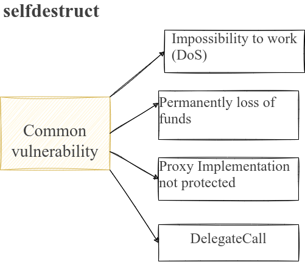

# selfdestruct 自毁关键字
[selfdestruct](https://rya-sge.github.io/access-denied/2024/03/13/EIP-6780-selfdestruct/)
- 在交易完成后销毁合约代码，从状态树中删除合约代码
- 将合约余额转给参数地址
- 自毁关键字下的转账行为是不可控，任何合约内部执行<kbd>selfdestruct</kbd>后都会把余额转给参数地址

## Dencun upgrade升级
- selfdestruct 交易仅仅将合约余额发送到传参地址
- 不会清除合约状态和代码
- 销毁后，不用再次通过create2部署相同地址合约，原地址的状态和代码还保留在链上
- 销毁后，任何的 call|delegateCall 都不会失败
- 也不会存在代币锁仓的隐患，因为之前合约的逻辑和状态并未清空
```solidity
// SPDX-License-Identifier: MIT
pragma solidity ^0.8.26;

contract Sale {
    uint256 public num;

    function buy() external payable {
        num += 1;
        // _end();
    }

    function _end() public {
        // 仍然保留 num 状态变量的参数
        selfdestruct(payable(msg.sender));
    }

    function bal() external view returns (uint256 baln) {
        baln = address(this).balance;
    }
}

contract caller {
    constructor() payable {}

    function buy(Sale sale) external {
        (bool success, ) = address(sale).call{value: 100 wei}(
            abi.encodeWithSelector(sale.buy.selector)
        );
        if (!success) {
            revert();
        }
    }
}
```

## Dencun upgrade升级前的安全隐患

1. selfdestruct 交易把合约代码和状态全部从状态树中清掉了
### Impossibility to work
- 后续在部署同样address的合约也只是一个全新的合约了，内部的状态变量从新开始
- 销毁后，call 调用会失败，因为对方合约代码为空
- 销毁后的delegateCall交互仍然可以进行，只是不会进行实质操作
- Permanently loss of funds by sending ethers，内部没有逻辑处理，token会被锁仓在合约，直到同地址合约重新部署
- 


1. 注意自毁函数的调用权限设计
2. 自毁关键字会把余额无条件转给内部地址，因此需要注意潜在的余额攻击
```solidity
    function killself(address payable _addr)public {
        selfdestruct(_addr);
    }
```
