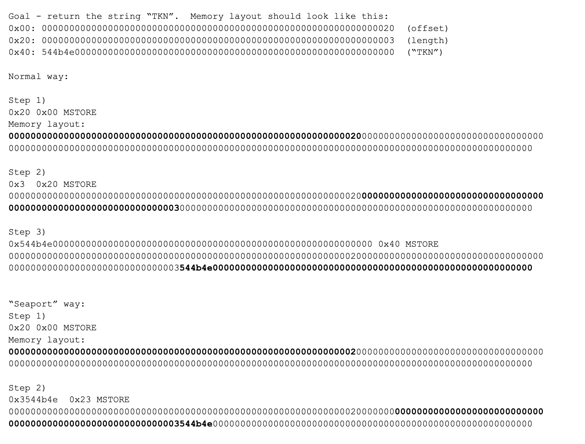
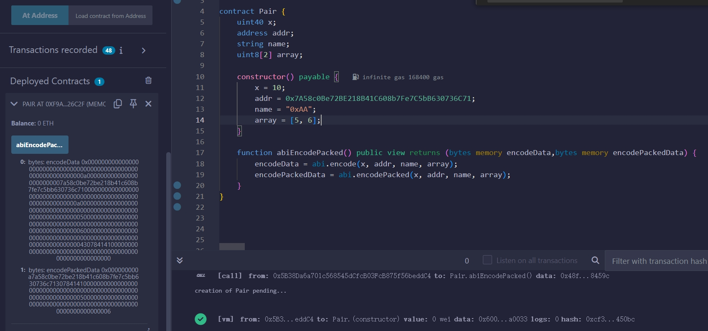

# ABI 编码
## abi.encode
- `Encode` 按照传参顺序编码合约函数传参，传参被编码成 `256bit(32bytes)`， 不满`256bit`的参数通过前向或后向补0
- 静态数据直接编码
- 动态数据由于动态长度的变化，编码数据分为三部分
### 静态传参编码规则：
- 静态参数(`int,uint,address,bool,bytes-n,定长数组，只包含静态参数的结构体`)高位补0，编码成`256bits`.
- 结构体作为 `tuples`， 按照数据定义顺序直接依次编码
- 枚举类型占位`uint8`，会高位补0直到满足 32 byets
- 自定义的类型按照原类型编码
### 动态传参编码规则：
- 动态参数编码(`string,bytes,不定长数组，包含动态参数的结构体`)分三部分：
  - 第一部分的 `256bits(32bytes)` 表明 `offset,calldata` 的起始位置 
  - 第二部分的 `256bits(32bytes)` 表明 `length,calldata` 中动态参数的长度 
  - 第三部分就是真实传参数数据，不满 `256bit` 的在补0
    - 静态类型高位补0
    - `bytes,string`类型的参数，低位补0

Examples-String:
> play(string) // play("Eze")

传参编码的规则：
1. 函数需要动态类型 `string` 传参
2. 按照传参顺序，第一行直接编码动态数组 `offset`, 之后紧接动态数据大小，（string数据低位补0）


Examples-动态数组:
> transfer(uint[], address)// [5769, 14894, 7854], 0x1b7e1b7ea98232c77f9efc75c4a7c7ea2c4d79f1

传参编码的规则：
1. 函数需要两个传参，第一个为动态数组，第二个为静态地址
2. 按照传参顺序，第一行先编码动态数组 `offset`, 动态数据大小为3，内部为静态类型（高位补0）
3. 第二行编码静态数据


Examples-静态参数结构体:
1. 带结构体传参的函数选择器和结构体内部参数类型相关
2. 函数需要两个传参，第一个为全是静态参数的结构体，第二个为静态地址
3. 按照传参顺序，从第一行开始，直接按照结构体内部参数的定义顺序编码内部参数，每个参数补位 `256 bit`
4. 静态地址编码到全部结构体参数后面

```solidity
// SPDX-License-Identifier: MIT
pragma solidity ^0.8.26;

contract C {
  struct RareToken {
    uint256 n;
  }
// `foo((uint256),address)`
  function foo(RareToken memory point, address addr) external pure {
    //...
  }

  function getSelector(string calldata str)
  external
  pure
  returns (bytes4, bytes4)
  {
    return (
      bytes4(this.foo.selector),
      bytes4(keccak256(abi.encodePacked(str))) //foo((uint256),address)
    );
  }
}
```
Examples-动态参数结构体:
```Solidity
    struct RareToken {
    string str;
    uint128 m;
    uint128 n;
}

    function foo(RareToken memory point, address addr) external pure {
        //...
    }
```
1. 带结构体传参的函数选择器和结构体内部参数类型相关：`foo((string,uint128,uint128),address)`
2. 函数需要两个传参，第一个为是包含动态参数的结构体，第二个为静态地址
3. 按照传参顺序，从第一行开始，编码结构体参数的 `offset`
4. 第二行编码静态地址 `addr`
5. 结构体数据从 `offset` 开始，再次按照数据编码模式进行编码
   1. 结构体按照顺序存储 `string, uint128, uint128`
   2. 第一行编码 `string` 参数的存储 `offset`
   3. 第二三行编码下面的静态参数
   4. 之后开始编码 `srting` 传参（数据低位补0）
```json
0x5c325b3d [“Eze”,12,23] 5b38da6a701c568545dcfcb03fcb875f56beddc4
0000000000000000000000000000000000000000000000000000000000000040 //动态结构体类型数据的起始位置
0000000000000000000000005b38da6a701c568545dcfcb03fcb875f56beddc4 // 静态数据，存储address
0000000000000000000000000000000000000000000000000000000000000060 //结构体数据动态类型的起始位置
000000000000000000000000000000000000000000000000000000000000000c //结构体静态数据1
0000000000000000000000000000000000000000000000000000000000000017 //结构体静态数据2
0000000000000000000000000000000000000000000000000000000000000003 //结构体数据动态类型的数据长度
4578650000000000000000000000000000000000000000000000000000000000 //结构体数据动态数据
```

Examples-静态参数的固定大小数组，传参编码的规则：
1. 静态参数的固定大小数组作为静态参数编码[variables.md](variables.md)
2. 按照传参顺序，直接依次编码静态数据传参

```solidity
// SPDX-License-Identifier: MIT
pragma solidity ^0.8.26;

contract Pair {
    uint256 x;
    address addr;
    string name;
    uint256[2] array;

    constructor() payable {
        x = 10;
        addr = 0x7A58c0Be72BE218B41C608b7Fe7C5bB630736C71;
        name = "0xAA";
        array = [5, 6];
    }

    function abiCode() public view returns (bytes memory data) {
        data = abi.encode(x, addr, name, array);
    }
}
```
>0x
> 000000000000000000000000000000000000000000000000000000000000000a //x = 10
> 
> 0000000000000000000000007a58c0be72be218b41c608b7fe7c5bb630736c71 // address
> 
> 00000000000000000000000000000000000000000000000000000000000000a0 // offset = 160, 表示数据从当前 data 的 第160位 开始读取
> 
> 0000000000000000000000000000000000000000000000000000000000000005 // array[0]
> 
> 0000000000000000000000000000000000000000000000000000000000000006 // array[1]
> 
> 0000000000000000000000000000000000000000000000000000000000000004 // 表明数据 length = 4
> 
> 3078414100000000000000000000000000000000000000000000000000000000

Examples-动态参数的固定大小数组，传参编码的规则：
1. 动态参数的固定大小数组作为动态参数编码
2. 按照传参顺序，依次编码各自参数的 `offset`，之后从 `offset` 开始存储真实数据的大小和数据
```solidity
plays(string[2])//play(["Eze","Sunday"])
```

非固定大小的数组传参`string[]`，需要将数组大小一起编码:


Examples-嵌套数组的编码，传参编码的规则：
- 直接按照参数顺序，按照动态数组的编码规则依次进行编码


### Seaport Return String
[Seaport](https://github.com/ProjectOpenSea/seaport-core/blob/main/src/Seaport.sol#L102)返回 `Seaport` 的函数：
```solidity
    function _name() internal pure override returns (string memory) {
        // Return the name of the contract.
        assembly {
            mstore(0x20, 0x20)
            mstore(0x47, 0x07536561706f7274)
            return(0x20, 0x60)
        }
    }
```
我们知道在 `slot` 存储静态类型数据的时候采用高位补0的方式，也就是全部数据放在低位存储

`string/bytes` 类型的数据高位存储，那么采用 `start + len` 大小的偏移量存储 `len+data` 静态数据的话：
- 静态数据全部低位存储
- 由于偏移量，当前`slot` 只会存储 `len`
- 同时，`data` 数据直接存储在了下一 `slot` 的高位

Examples-`TKN`:

将数据长度和真实数据作为静态数据直接存储，由于偏移量的原因，节省一步 `mstore`.


### abi.encodePacked
- 在数据顺序上进行最低空间编码，省略编码中的填充0
- 动态类型数据只保留数据，不填充长度字段
  - `keccak256(abi.encodePacked(“a”, “b”, “c”)) == keccak256(abi.encodePacked(“a”, “bc”)) == keccak256(abi.encodePacked(“ab”, “c”))`
- 当数据不需要和合约交互，只是用来查看数据的情况下就可以使用 `encodepacked` 节省数据空间
- `encodePacked` 不能编码 `struct`、`nextedArray`(`以及包含多维数组的map`)
```solidity
// SPDX-License-Identifier: MIT
pragma solidity ^0.8.26;

contract Pair {
    uint40 x;
    address addr;
    string name;
    uint8[2] array;
    Tree tree;
    uint8[][]loc;
    mapping(uint256=>uint8[][])nextArrayMap;

    struct Tree {
        uint256 leaves;
        uint256 age;
    }

    constructor() payable {
        x = 10;
        addr = 0x7A58c0Be72BE218B41C608b7Fe7C5bB630736C71;
        name = "0xAA";
        array = [5, 6];
        tree = Tree({leaves: 100, age: 1000});
        loc[0].push(6);
        loc[0].push(7);
        nextArrayMap[0]= loc;
    }

    function abiEncodePacked()
    public
    view
    returns (bytes memory encodeData, bytes memory encodePackedData)
    {
        encodeData = abi.encode(x, addr, name, array);
        encodePackedData = abi.encodePacked(x, addr, name, array,nextArrayMap,tree,loc);
    }
}
```

>0x000000000a //uint40 40bit
> 
> 7a58c0be72be218b41c608b7fe7c5bb630736c71
> 
> 30784141
> 
> 0000000000000000000000000000000000000000000000000000000000000005
> 
> 0000000000000000000000000000000000000000000000000000000000000006



### abi.decode
解码 `encode` 的合约参数，将编码数据解码回原本数据，解码函数中需要提供待解析的编码和解析后的参数类型
```solidity
    function decode(bytes memory data) public pure returns(uint dx, address daddr, string memory dname, uint[2] memory darray) {
        (dx, daddr, dname, darray) = abi.decode(data, (uint, address, string, uint[2]));
    }
```

## Preference
https://www.rareskills.io/post/abi-encoding
