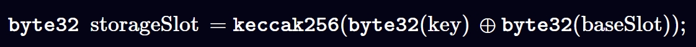

# Solidity参数

## 数据变量作用域
1. 状态变量
 - 定义在合约函数函数外，存储在链上的变量
2. 局部变量。 
 - 定义在合约函数内部，仅在函数执行过程中有效的数据，变量生命周期和函数执行周期一致
```solidity
// SPDX-License-Identifier: MIT
pragma solidity ^0.8.26;

contract Variables {
    // State variables are stored on the blockchain.
    string public hello = "Hello";
    uint256 public num = 123;

    function interVariables() public view returns (uint256 ts) {
        // Local variables are not saved to the blockchain.
        uint256 i = 456;
        // Here are some global variables
        ts = block.timestamp; // 147 gas cost
        // assembly {
        //     ts := timestamp() // 213 gas cost
        // }
        {
            // 可以使用合约状态变量/本函数内部的局部变量/区块链上全局变量
            uint interTs = 356;
            interTs += block.timestamp;
            interTs += i;
            interTs += num;
        }
       // interTs +=9; 外部无法访问作用域内部的参数
    }
}
```
3. [全局变量](https://www.evm.codes/?fork=cancun#40)。
 - solidity用于获取区块链数据，全局变量编码到EVM字节码中
 - Solidity 语言层面获取全局变量
 - Assembly 获取全局变量


## 参数修饰符
参数在合约中的存储方式： storage(可修改),Bytecodes(constant/immutable,不可修改),(memory,stack,calldata)

### 合约数据存储
- Bytecodes
  - 常量参数在合约编译时将该变量编译到合约Bytecodes。
  - 在合约使用期间，无需在内部存储中维护该常量的状态。 
  - constant变量在合约编译时将值存储在合约的字节码中，因此后续数据变量无法更改 
  - immutable数据为合约的状态变量，需要在构造函数中初始化。初始化参数在合约部署是被编码到Bytecodes，直接存储上链。后续无法更改。
  - 数值变量可以声明为constant 和 immutable，但是 动态变量 只能声明为constant
```solidity
// SPDX-License-Identifier: MIT
pragma solidity ^0.8.26;

contract Constants {
    // coding convention to uppercase constant variables
    address public constant MY_ADDRESS =
        0x777788889999AaAAbBbbCcccddDdeeeEfFFfCcCc;
    uint256 public constant MY_UINT = 123;
}
```
- storage。 存储上链的状态变量，storage和合约状态数据挂钩。
  - 通过Write交易修改合约数据
### 合约运行时的数据存储
- memory。 函数执行过程中用于存储动态分配的数据，如临时变量、函数参数和函数返回值等
- stack。函数执行过程中存储数据，如基本数据类型和值类型的局部变量。当你在内部函数中声明一个基本类型的局部变量时，它会被分配到stack中。

- calldata。 和memory类似，数据存储在内存中，但是 <kbd>calldata</kbd>数据无法修改，一般用于函数的输入参数
```solidity
    function fCalldata(uint[] calldata _x) public pure returns(uint[] calldata){
        //参数为calldata数组，不能被修改
        // _x[0] = 0 //这样修改会报错
        return(_x);
    }
```
## 数据引用作用域
1. 普通状态变量 -> 普通状态变量(拷贝)
2. 普通状态变量 -> storage变量(引用)
3. 普通状态变量 -> memory变量(拷贝)
4. storage变量 -> storage变量(引用)
5. storage变量 -> memory变量(拷贝)
6. storage变量 -> 普通状态变量(引用)
7. memory变量 -> memory变量(引用)
8. memory变量 -> 普通状态变量(拷贝)
```solidity
// SPDX-License-Identifier: MIT
pragma solidity ^0.8.26;

contract StateToStateContract {
  uint8[3] public static_array = [1, 2, 3]; //State 状态变量
  uint8[3] public static_array_two;
  uint256[] public dynamic_array;
  event LogUint8(uint8);
  event staticArrays(uint8[3], uint8[3]);
  event dynamicArrays(uint256[], uint256[]);

  function stateToany() public {
    //状态变量 -> 状态变量(拷贝),双方互不影响
    static_array_two = static_array;
    static_array_two[0] = 8;
    emit staticArrays(static_array, static_array_two); //[1,2,3],[8,2,3]
    //状态变量 -> storage变量(引用),引用拷贝，修改任意变量的值会影响另一个状态变量的值，更新合约状态参数
    uint256[] storage tem_dynamic_array = dynamic_array;
    tem_dynamic_array.push(10086);
    emit dynamicArrays(dynamic_array, tem_dynamic_array); //[10086],[10086]
    //状态变量 -> memory变量(拷贝)
    uint256[] memory tem_dynamic_array_two = dynamic_array;
    tem_dynamic_array_two[tem_dynamic_array_two.length - 1] = 999;
    emit dynamicArrays(dynamic_array, tem_dynamic_array_two); //[10086],[999]
  }

  function storageToany() public {
    //storage变量 -> storage变量(引用),引用拷贝，修改任意变量的值会影响另一个状态变量的值，更新合约状态参数
    uint256[] storage tem_dynamic_array = dynamic_array;
    tem_dynamic_array.push(12);
    emit dynamicArrays(dynamic_array, tem_dynamic_array); //[12]，[12]
    uint256[] storage tem_dynamic_array_two = tem_dynamic_array;
    tem_dynamic_array_two.push(13);
    emit dynamicArrays(dynamic_array, tem_dynamic_array); //[12,13],[12,13]
    emit dynamicArrays(tem_dynamic_array, tem_dynamic_array_two); //[12,13],[12,13]
    //storage变量 -> memory变量(拷贝)
    uint256[] memory tem_dynamic_array_memory = tem_dynamic_array;
    tem_dynamic_array_memory[0] = 14;
    emit dynamicArrays(tem_dynamic_array, tem_dynamic_array_memory); //[12,13],[14,13]
    // storage变量 -> 状态变量(引用)，引用拷贝，修改任意变量的值会影响另一个状态变量的值，更新合约状态参数
    dynamic_array = tem_dynamic_array;
    dynamic_array[0] = 15;
    emit dynamicArrays(dynamic_array, tem_dynamic_array); //[15,13],[15,13]
    tem_dynamic_array.push(16);
    emit dynamicArrays(dynamic_array, tem_dynamic_array); //[15,13,16],[15,13,16]
  }

  function memoryToany() public {
    // memory变量 -> 状态变量(拷贝)
    uint8[3] memory tem_static_array = static_array;
    tem_static_array[0] = 4;
    emit staticArrays(static_array, tem_static_array); //[1,2,3],[4,2,3]
    // memory变量 -> memory变量(引用)，引用拷贝，修改任意变量的值会影响另一个状态变量的值，更新合约状态参数
    uint8[3] memory tem_static_array_two = tem_static_array;
    tem_static_array_two[2] = 5;
    emit staticArrays(static_array, tem_static_array); //[1,2,3],[4,2,5]
    emit staticArrays(tem_static_array, tem_static_array_two); //[4,2,5],[4,2,5]
  }
}
```
## 修改链上状态的语句
1. 更新合约内部的状态变量
2. emit event 触发链上事件
3. 创建其他合约
4. self destruct 销毁合约（将code数据从状态树中移除）
5. 转账，更新账户余额
6. 调用其他未标记 pure/view的函数
7. 使用内联编码更改状态数据库

## stack slot 存储
1. [slot存储](https://yuhuajing.github.io/ethernaut-book/12-Privacy/Privacy.html)
### 数值数据类型占位存储
| Type                   | Bit |  
|------------------------|-----|
| boolean                | 8   | 
| uint8/int8/bytes1      | 8   | 
| uint32/int32/bytes4    | 32  | 
| uint128/int128/bytes16 | 128 | 
| uint256/int256/bytes32 | 256 | 
| address                | 160 |
- slot存储和函数声明顺序相关，不满栈宽256bit的会高位补到同一个slot
```solidity
contract AddressVariable {
    address owner = 0x5B38Da6a701c568545dCfcB03FcB875f56beddC4;
    // new
    bool Boolean = true;
    uint32 thirdvar;
}
```
- 其中，owner 占位 160 bit, Boolean 占位 8 bit, thirdvar 占位 32 bit
- 三个变量按照证明顺序，高位编码到同一个slot存储
- 此时，slot剩余 56 bit，下个声明变量的类型如果超出 56 bit，会顺延到 下一个 slot 存储

```solidity
contract AddressVariable {
    address owner = 0x5B38Da6a701c568545dCfcB03FcB875f56beddC4;
    bool Boolean = true;
    uint32 thirdVar;
    // new
    address admin = 0xAb8483F64d9C6d1EcF9b849Ae677dD3315835cb2;
}
```


## 动态数据类型存储
| Type     | Bit |  
|----------|-----|
| mappings | 8   | 
| arrays   | 8   | 
| string   | 32  | 
| bytes    | 128 | 
| structs  | 256 |
### Mapping数据存储
```solidity
// SPDX-License-Identifier: MIT
pragma solidity =0.8.26;

contract MyMapping {
  uint256 a; // storage slot 0
  uint256 b; // storage slot 1
  uint256 c; // storage slot 2
  uint256 d; // storage slot 3
  uint256 e; // storage slot 4
  uint256 f; // storage slot 5
  mapping(address => uint256) private balance; // storage slot 6

  constructor() {
    balance[0x5B38Da6a701c568545dCfcB03FcB875f56beddC4] = 9; // RED
    balance[address(0x03)] = 10; // GREEN
  }

  //*** NEWLY ADDED FUNCTION ***//
  function getStorageSlot(address _key)
  public
  pure
  returns (uint256 balanceMappingSlot, bytes32 slot)
  {
    assembly {
    // `.slot` returns the state variable (balance) location within the storage slots.
    // In our case, balance.slot = 6
      balanceMappingSlot := balance.slot
    }

    slot = keccak256(
      abi.encode(
        bytes32(abi.encode(_key)),
        bytes32(abi.encode(balanceMappingSlot))
      )
    );
  }

  function getValue(address _key)
  public
  view
  returns (bytes32 slot, uint256 value)
  {
    // CALL HELPER FUNCTION TO GET SLOT

    (, slot) = getStorageSlot(_key);

    assembly {
    // Loads the value stored in the slot
      value := sload(slot)
    }
  }
}
```
- Mapping[key] = value
- Mapping value数据存储位置和 声明顺序(baseSlot)以及key值 相关
- 计算Mapping的存储位置时，聚合 bytes32(Key) 和 bytes32(slot),聚合成 bytes64的值


### 嵌套Mapping数据存储
- Mapping(key=>Mapping(...),


- 多重嵌套mappin的slot存储规则：每层的key作为下层的baseSlot值参与计算
```solidity
// SPDX-License-Identifier: MIT
pragma solidity =0.8.26;

contract MyNestedMapping {
    uint256 a; // storage slot 0
    uint256 b; // storage slot 1
    uint256 c; // storage slot 2
    uint256 d; // storage slot 3
    uint256 e; // storage slot 4
    uint256 f; // storage slot 5
    mapping(address => mapping(uint256 => uint256)) public balance; // storage slot 6

    constructor() {
        balance[0x5B38Da6a701c568545dCfcB03FcB875f56beddC4][123] = 9; // RED
    }

    //*** NEWLY ADDED FUNCTION ***//
    function getStorageSlot(address key1, uint256 key2)
        public
        pure
        returns (uint256 balanceMappingSlot, bytes32 slot)
    {
        assembly {
            // `.slot` returns the state variable (balance) location within the storage slots.
            // In our case, balance.slot = 6
            balanceMappingSlot := balance.slot
        }

        bytes32 slot1 = keccak256(
            abi.encode(
                bytes32(abi.encode(key1)),
                bytes32(abi.encode(balanceMappingSlot))
            )
        );
        slot = keccak256(abi.encode(bytes32(abi.encode(key2)), slot1));
    }

    function getValue(address key1, uint256 key2)
        public
        view
        returns (bytes32 slot, uint256 value)
    {
        // CALL HELPER FUNCTION TO GET SLOT

        (, slot) = getStorageSlot(key1, key2);

        assembly {
            // Loads the value stored in the slot
            value := sload(slot)
        }
    }

    function convert(string memory key) internal pure returns (bytes32 ret) {
        require(bytes(key).length <= 32);

        assembly {
            ret := mload(add(key, 32))
        }
    }
}
```
### Arrays数据存储
#### 定长数组
- 定长数组作为固定大小的参数
- 数据存储按照静态类型依次slot存储
- 定长数组不和其他参数共享slot
```solidity
// SPDX-License-Identifier: MIT
pragma solidity =0.8.26;

contract MyFixedUint256Array {
    uint256 num; // storage slot 0

    uint64[3] myArr = [
        4, // storage slot 1
        9, // storage slot 1
        2 // storage slot 1
    ];
    uint64 next = 5; //storage slot 2
    uint128[3] bigArr = [
        4, // storage slot 3
        9, // storage slot 3
        2 // storage slot 4
    ];
    uint64 bnext = 5; //storage slot 5

    function getValue(uint256 index) public view returns (uint256 value) {
        // CALL HELPER FUNCTION TO GET SLOT
        assembly {
            // Loads the value stored in the slot
            value := sload(index)
        }
    }
}
```
#### 不定长数组--arrays[]
- 不定长数据在合约编译时无法确认数据size，所以在 baseSlot 存储当前参数的size
- 不定长数组具体数据的起始位置和baseSlot相关：keccak256（baseSlot）
- 不定长数组的数据依次从起始位置开始入栈存储
- 不定长数组的数据按照数值类型继续存储，slot进行高位补足存储数组参数
- 数值长度超出256bit后，顺延至下一个slot存储 （index += 1）
```solidity
// SPDX-License-Identifier: MIT
pragma solidity =0.8.26;

contract MyDynArray {
  uint256 private someNumber; // storage slot 0
  address private someAddress; // storage slot 1
  uint32[] private myDynamicArr = [3, 4, 5, 9, 7]; // storage slot 2

  function getSlot(uint256 _index) public pure returns (uint256 slot) {
    uint256 baseSlot;
    assembly {
    // `.slot` returns the state variable (balance) location within the storage slots.
    // In our case, balance.slot = 6
      baseSlot := myDynamicArr.slot
    }
    slot = uint256(keccak256(abi.encode(baseSlot))) + _index;
  }

  function getSlotValue(uint256 slot) public view returns (bytes32 value) {
    assembly {
      value := sload(slot)
    }
  }
}
```

- 数据类型变成 `uint64[] private myDynamicArr = [3, 4, 5, 9, 7]; // storage slot 2`:
  - 一个slot最多存储4个数组参数
  - 因此，起始位置 index=0 的 slot 能够存储 `3,4,5,9` 四个参数
  - 剩余参数顺眼至下一个slot
  - 因此，起始位置 index=0 的 slot 存储 `7`
#### 多维不定长数组
- array[][]... `uint64[][] private nestedDynamicArray = [[2, 9, 6, 3, 2], [7, 4, 8, 10, 2]]; `
- baseSlot存储当前数组大小,示例大小为2
- 进一步确认内部嵌套的数组大小，存储内部数组大小的 slot_array_size 和 数组 index 相关：slot_array_size = keccak256（baseSlot）+ index
- 嵌套数组内部的数据 slot_array_data_loc 和 slot_array_size 以及内部 internal_index 相关：slot_array_data_loc = keccak256（slot_array_size）+ internal_index
- 嵌套数组内部的数据存储按照单维存储规则
```solidity
// SPDX-License-Identifier: MIT
pragma solidity =0.8.26;

contract MyNestedArray {
  uint256 private someNumber; // storage slot 0

  // Initialize nested array
  uint64[][] private nestedDynamicArray = [[2, 9, 6, 3, 2], [7, 4, 8, 10, 2]]; // storage slot 1

  function getArrSizeLoc_BaseSlot_Index(uint256 index)
  public
  pure
  returns (uint256 slot)
  {
    uint256 baseSlot;
    for (uint256 i; i <= index; i++) {
      if (i == 0) {
        assembly {
        // `.slot` returns the state variable (balance) location within the storage slots.
        // In our case, balance.slot = 6
          baseSlot := nestedDynamicArray.slot
        }
      }
      slot = uint256(keccak256(abi.encode(baseSlot))) + index;
    }
  }

  function getArrDataLoc_SlotLoc_InternalIndex(uint256 locslot, uint256 index)
  public
  pure
  returns (uint256 slot)
  {
    slot = uint256(keccak256(abi.encode(locslot))) + index;
  }

  function getSlot(
    uint256 baseSlot,
    uint256 _index1,
    uint256 _index2
  ) public pure returns (bytes32 _finalSlot) {
    // keccak256(baseSlot) + _index1
    uint256 _initialSlot = uint256(keccak256(abi.encode(baseSlot))) +
          _index1;

    // keccak256(_initialSlot) + _index2
    _finalSlot = bytes32(
      uint256(keccak256(abi.encode(_initialSlot))) + _index2
    );
  }

  function getSlotValue(uint256 _slot) public view returns (uint256 value) {
    assembly {
      value := sload(_slot)
    }
  }

  function addArray() external {
    nestedDynamicArray.push([22, 6, 99, 14]);
  }
}
```
数据：[[2, 9, 6, 3, 2], [7, 4, 8, 10, 2]]，Array[array1,array2]
#### 动态数据类型存储
| 说明                       | slot                                                                                        | Value                                                               |
|--------------------------|---------------------------------------------------------------------------------------------|---------------------------------------------------------------------|
| baseSlot                 | 1                                                                                           | 2                                                                   |
| array1<br/>存储size的slot,s1     | keccack(1)+0=<br/>80084422859880547211683076133703299733277748156566366325829078699459944778998  | 5                                                                   |
| array2<br/>存储size的slot,s2     | keccack(1)+1=<br/>80084422859880547211683076133703299733277748156566366325829078699459944778999  | 5                                                                   |
| array1<br/>存储index0的数据slot,d1 | keccack(s1)+0=<br/>82253526175936117417672031222849803842933200219522072251142807856800200228130 | 0x0000000000000003000000000000000600000000000000090000000000000002  |
| array1<br/>存储index1的数据slot,d2 | keccack(s1)+1=<br/>82253526175936117417672031222849803842933200219522072251142807856800200228131 | 0x0000000000000000000000000000000000000000000000000000000000000002  |
| array2<br/>存储index0的数据slot,d3 | keccack(s2)+0=<br/>106053296617608346790393806727882046642653284128270527600775845709961105489201 |0x000000000000000a000000000000000800000000000000040000000000000007|
| array2<br/>存储index1的数据slot,d4 | keccack(s2)+1=<br/>106053296617608346790393806727882046642653284128270527600775845709961105489202 |0x0000000000000000000000000000000000000000000000000000000000000002|

### String
- string 作为动态类型:
  - 短string(<31bytes),baseSlot存储string以及size（len(string) * 2）,string中每个字符占据两位
  - 短string,string data编码在高位，size编码在低位

  - 长string(>31bytes),baseSlot仅存储size(len(string) * 2 + 1）
  - 长string data 存储的起始slot = keccak256(baseSlot),依次顺延存储

#### size
- 长/短 string 的size计算方式不同的原因在于让字节码更好的区分string的长短
- 短 string 的size  = len(string)*2 表示偶数，因此最后一位一定是0
- 长 string 的size = len(string)*2+1 表示奇数，最后一位一定是1
```solidity
// SPDX-License-Identifier: MIT
pragma solidity =0.8.26;

contract ModMethod {
    // Gas cost: 326
    function isEvenMod(uint256 num) public pure returns (bool x) {
        x = (num % 2) == 0;
    }

    // Gas cost: 272
    function isEvenAnd(uint256 num) public pure returns (bool x) {
        x = (num & 1) == 0;
    }
}
```
- string作为动态数据，可能存储非ascII值，因此通过bytes计算长度
```solidity
// SPDX-License-Identifier: MIT
pragma solidity =0.8.26;

contract StringLen {
    string str1 = "Hello World";
    string str2 = unicode"酱香拿铁"; // ecah charactor occupy 3 bytes

    function lenth() public view returns (uint256 str1len, uint256 str2len) {
        str1len = bytes(str1).length;
        str2len = bytes(str2).length;
    }
}
```
### Bytes
- bytes动态数组slot存储规则和string一致
- bytes0x 固定大小数组 和 array固定数组存储规则一致
### Struct
- 结构体内部数据直接从baseSlot依次按照类型存储
