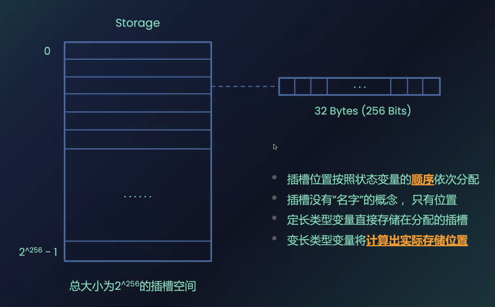

# Data Types
## 数据类型
- `Solidity EVM` 在宽 `256bit` 深 `2^256` 的栈空间存储合约数据
- 合约内部数据分为定长数值类型和非定长的引用类型

### 数值类型 
**数值类型**赋值时直接传递值，包含 `boolean`，整数型（`uint8~uint256,int8~int256`），`address，定长bytes（bytes1~bytes32）`
- `boolean` 类型是二值变量， 取值 `true|false，default：false` 
  - 运算符包括： 
  - !（非） 
  - && （与，短路规则，如果前者false，就不会执行后者） 
  - || （或，短路规则，如果前者true，就不会执行后者） 
  - == （判等） 
  - != （不等）
- `uint/int` 整型,`default: 0`
  - 运算符包括： 
  - 比较运算符，返回`bool (> < >= <= == !=)`
  - 算数运算符`（+ - * / % ** <<  >>）`
- `address`类型
  - `address` 类型，可以使用 `payable()` 修饰，用于接收 `NativeToken`（触发 `receiver()` 函数或缺省函数 `fallback()` ）
数值类型合约示例：
```solidity
// SPDX-License-Identifier: MIT
pragma solidity ^0.8.26;

contract Static_variables {
    bool public boo = true;

    /*
    uint stands for unsigned integer, meaning non negative integers
    different sizes are available
        uint8   ranges from 0 to 2 ** 8 - 1
        uint16  ranges from 0 to 2 ** 16 - 1
        ...
        uint256 ranges from 0 to 2 ** 256 - 1
    */
    uint8 public u8 = 1;
    uint256 public u256 = 456;
    uint256 public u = 123; // uint is an alias for uint256

    /*
    Negative numbers are allowed for int types.
    Like uint, different ranges are available from int8 to int256
    
    int256 ranges from -2 ** 255 to 2 ** 255 - 1
    int128 ranges from -2 ** 127 to 2 ** 127 - 1
    */
    int8 public i8 = -1;
    int256 public i256 = 456;
    int256 public i = -123; // int is same as int256

    // minimum and maximum of uint
    uint256 public minUInt = type(uint256).min;
    uint256 public maxUInt = type(uint256).max;

    // minimum and maximum of int
    int256 public minInt = type(int256).min;
    int256 public maxInt = type(int256).max;

    address public addr = 0xCA35b7d915458EF540aDe6068dFe2F44E8fa733c;

    /*
    In Solidity, the data type byte represent a sequence of bytes. 
    Solidity presents two type of bytes types :

     - fixed-sized byte arrays
     - dynamically-sized byte arrays.
     
     The term bytes in Solidity represents a dynamic array of bytes. 
     It’s a shorthand for byte[] .
    */
    bytes1 a = 0xb5; //  [10110101]
    bytes1 b = 0x56; //  [01010110]

    // Default values
    // Unassigned variables have a default value
    bool public defaultBoo; // false
    uint256 public defaultUint; // 0
    int256 public defaultInt; // 0
    address public defaultAddr; // 0x0000000000000000000000000000000000000000
    bytes1 public c; //0x00
}
```
### 引用类型
**引用类型**：array[]数组，bytes，定长数组，struct结构体，mapping映射
- 数组:动态数组拥有 `push/pop` 内置函数，分别在数组最后增加或删除一个元素
```solidity
// SPDX-License-Identifier: MIT
pragma solidity ^0.8.26;

contract Dynamic_variables_array {
    // Several ways to initialize an array
    uint256[] public indeterminate_arr;
    uint256[] public indeterminate_init_arr = [1, 2, 3];
    // Fixed sized array, all elements initialize to 0
    uint256[10] public determinate_arr;

    function get(uint256 i) public view returns (uint256) {
        return indeterminate_arr[i];
    }

    // Solidity can return the entire array.
    // But this function should be avoided for
    // arrays that can grow indefinitely in length.
    function getArr() public view returns (uint256[] memory) {
        return indeterminate_arr;
    }

    function indeterminate_push(uint256 i) public {
        // Append to array
        // This will increase the array length by 1.
        indeterminate_arr.push(i);
        indeterminate_init_arr.push(i);
    }

    function determinate_push(uint256 index, uint256 i) public {
        // Append to array
        // This will increase the array length by 1.
        determinate_arr[index] = i;
    }

    function indeterminate_pop() public {
        // Remove last element from array
        // This will decrease the array length by 1
        indeterminate_arr.pop();
        indeterminate_init_arr.pop();
    }

    function getLength() public view returns (uint256) {
        return indeterminate_arr.length;
    }

    function remove_not_change_length(uint256 index) public {
        // Delete does not change the array length.
        // It resets the value at index to it's default value,
        // in this case 0
        delete indeterminate_arr[index];
        delete determinate_arr[index];
    }

    // Deleting an element creates a gap in the array.
    // One trick to keep the array compact is to
    // move the last element into the place to delete.
    function remove_change_length(uint256 index) public {
        // Move the last element into the place to delete
        indeterminate_arr[index] = indeterminate_arr[
            indeterminate_arr.length - 1
        ];
        // Remove the last element
        indeterminate_arr.pop();
    }

    function examples_new_determinate_arr() external pure {
        // create array in memory, only fixed size can be created
        uint256[] memory a = new uint256[](5);
        a[0] = 5;
    }
}
```
