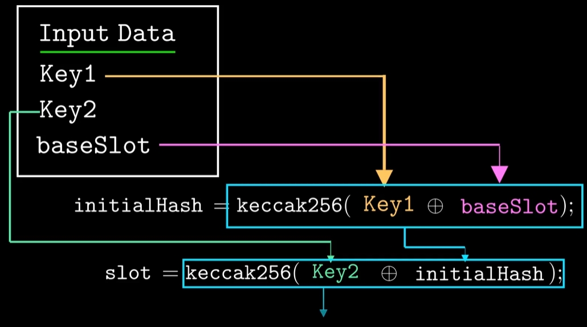

# Solidity参数
## 动态数据类型存储
### Mapping数据存储
- `Mapping value` 数据的存储位置和声明顺序 `baseSlot` 以及 `key` 值相关
  - 直接聚合 `bytes32(Key)` 和 `bytes32(baseSlot)`
  - 哈希聚合结果，找出 `mapping value` 的真实数据存位置
  

```solidity
// SPDX-License-Identifier: MIT
pragma solidity =0.8.26;

contract MyMapping {
  uint256 a; // storage slot 0
  uint256 b; // storage slot 1
  uint256 c; // storage slot 2
  uint256 d; // storage slot 3
  uint256 e; // storage slot 4
  uint256 f; // storage slot 5
  mapping(address => uint256) private balance; // storage slot 6
  mapping(string => uint256) private strbalance; // storage slot 7

  constructor() {
    strbalance["aaa"] = 9; // RED
    balance[address(0x1)] = 7;
  }

  //*** NEWLY ADDED FUNCTION ***//
  function getStorageSlot(address _key)
  public
  pure
  returns (uint256 balanceMappingSlot, bytes32 slot)
  {
    assembly {
    // `.slot` returns the state variable (balance) location within the storage slots.
    // In our case, balance.slot = 6
      balanceMappingSlot := balance.slot
    }

    slot = keccak256(
      abi.encode(
        bytes32(abi.encode(_key)),
        bytes32(abi.encode(balanceMappingSlot))
      )
    );
  }

  function getValue(address _key)
  public
  view
  returns (bytes32 slot, uint256 value)
  {
    // CALL HELPER FUNCTION TO GET SLOT

    (, slot) = getStorageSlot(_key);

    assembly {
    // Loads the value stored in the slot
      value := sload(slot)
    }
  }

  //*** NEWLY ADDED FUNCTION ***//
  function getStringStorageSlot(string memory key)
  public
  pure
  returns (uint256 balanceMappingSlot, bytes32 slot)
  {
    assembly {
    // `.slot` returns the state variable (strbalance) location within the storage slots.
      balanceMappingSlot := strbalance.slot
    }
    slot = keccak256(
      abi.encodePacked(
        abi.encodePacked(key),
        bytes32(abi.encode(balanceMappingSlot))
      )
    );
  }

  function getStringValue(string memory _key)
  public
  view
  returns (bytes32 slot, uint256 value)
  {
    // CALL HELPER FUNCTION TO GET SLOT

    (, slot) = getStringStorageSlot(_key);

    assembly {
    // Loads the value stored in the slot
      value := sload(slot)
    }
  }
}
```

#### Seaport获取 Mapping值
```solidity
// error ChannelClosed(address channel)
uint256 constant ChannelClosed_error_signature = (
    0x93daadf200000000000000000000000000000000000000000000000000000000
);
uint256 constant ChannelClosed_error_ptr = 0x00;
uint256 constant ChannelClosed_channel_ptr = 0x4;
uint256 constant ChannelClosed_error_length = 0x24;

// For the mapping:
// mapping(address => bool) channels
// The position in storage for a particular account is:
// keccak256(abi.encode(account, channels.slot))
uint256 constant ChannelKey_channel_ptr = 0x00;
uint256 constant ChannelKey_slot_ptr = 0x20;
uint256 constant ChannelKey_length = 0x40;

contract Conduit  {
  // Track the status of each channel.
  mapping(address => bool) private _channels;

  /**
   * @notice Ensure that the caller is currently registered as an open channel
     *         on the conduit.
     */
  modifier onlyOpenChannel() {
    // Utilize assembly to access channel storage mapping directly.
    assembly {
    // Write the caller to scratch space.
      mstore(ChannelKey_channel_ptr, caller())

    // Write the storage slot for _channels to scratch space.
      mstore(ChannelKey_slot_ptr, _channels.slot)

    // Derive the position in storage of _channels[msg.sender]
    // and check if the stored value is zero.
      if iszero(
        sload(keccak256(ChannelKey_channel_ptr, ChannelKey_length))
      ) {
      // The caller is not an open channel; revert with
      // ChannelClosed(caller). First, set error signature in memory.
        mstore(ChannelClosed_error_ptr, ChannelClosed_error_signature)

      // Next, set the caller as the argument.
        mstore(ChannelClosed_channel_ptr, caller())

      // Finally, revert, returning full custom error with argument
      // data in memory.
      // revert(abi.encodeWithSignature(
      //     "ChannelClosed(address)", caller()
      // ))
        revert(ChannelClosed_error_ptr, ChannelClosed_error_length)
      }
    }

    // Continue with function execution.
    _;
  }
}
```

### 嵌套Mapping数据存储
- Mapping(key=>Mapping(...))
- 多重嵌套 `mapping` 的 `slot` 存储规则
  - 每层的 `key` 作为下层的 `baseSlot` 值参与计算
  - 最外层的 `key` 和参数声明顺序相关
  



```solidity
// SPDX-License-Identifier: MIT
pragma solidity =0.8.26;

contract MyNestedMapping {
    uint256 a; // storage slot 0
    uint256 b; // storage slot 1
    uint256 c; // storage slot 2
    uint256 d; // storage slot 3
    uint256 e; // storage slot 4
    uint256 f; // storage slot 5
    mapping(address => mapping(uint256 => uint256)) public balance; // storage slot 6

    constructor() {
        balance[0x5B38Da6a701c568545dCfcB03FcB875f56beddC4][123] = 9; // RED
    }

    //*** NEWLY ADDED FUNCTION ***//
    function getStorageSlot(address key1, uint256 key2)
        public
        pure
        returns (uint256 balanceMappingSlot, bytes32 slot)
    {
        assembly {
            // `.slot` returns the state variable (balance) location within the storage slots.
            // In our case, balance.slot = 6
            balanceMappingSlot := balance.slot
        }

        bytes32 slot1 = keccak256(
            abi.encode(
                bytes32(abi.encode(key1)),
                bytes32(abi.encode(balanceMappingSlot))
            )
        );
        slot = keccak256(abi.encode(bytes32(abi.encode(key2)), slot1));
    }

    function getValue(address key1, uint256 key2)
        public
        view
        returns (bytes32 slot, uint256 value)
    {
        // CALL HELPER FUNCTION TO GET SLOT

        (, slot) = getStorageSlot(key1, key2);

        assembly {
            // Loads the value stored in the slot
            value := sload(slot)
        }
    }

    function convert(string memory key) internal pure returns (bytes32 ret) {
        require(bytes(key).length <= 32);

        assembly {
            ret := mload(add(key, 32))
        }
    }
}
```
