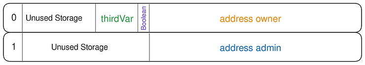

# Solidity参数
## 数值数据类型占位存储
| Type                   | Bit |  
|------------------------|-----|
| boolean                | 8   | 
| uint8/int8/bytes1      | 8   | 
| uint32/int32/bytes4    | 32  | 
| uint128/int128/bytes16 | 128 | 
| uint256/int256/bytes32 | 256 | 
| address                | 160 |
| enum                   | 8   |
- `slot` 存储位置和合约状态变量声明顺序相关，不满栈宽 `256bit` 高位补到同一个 `slot`
```solidity
contract AddressVariable {
    address owner = 0x5B38Da6a701c568545dCfcB03FcB875f56beddC4;
    // new
    bool Boolean = true;
    uint32 thirdvar;
}
```
- 其中，`owner` 占位 `160 bit`, `Boolean` 占位 `8 bit`, `thirdvar` 占位 `32 bit`
- 三个变量按照证明顺序，高位编码到同一个slot存储
- 此时，`slot` 剩余 `56 bit`，下个声明变量的类型如果超出 `56 bit`，会顺延到 下一个 `slot` 存储


```solidity
contract AddressVariable {
    address owner = 0x5B38Da6a701c568545dCfcB03FcB875f56beddC4;
    bool Boolean = true;
    uint32 thirdVar;
    // new
    address admin = 0xAb8483F64d9C6d1EcF9b849Ae677dD3315835cb2;
}
```

