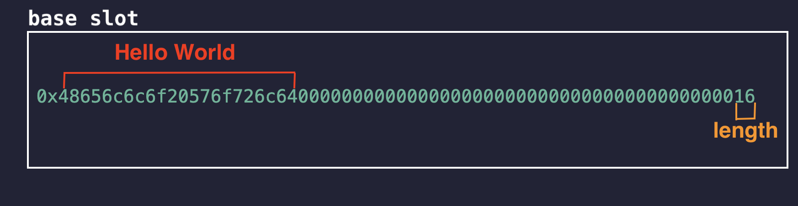
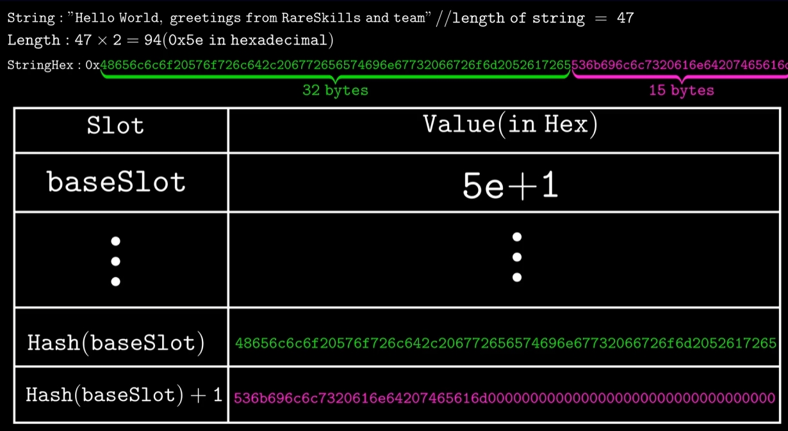

# Solidity参数
## 动态数据类型存储
### String
- string 作为动态类型:
  - 短 `string(<31bytes),baseSlot` 存储 `string以及size（len(string) * 2）`, `string` 中每个字符占据两位
  - 短 `string`,` string data` 编码在高位，`size` 编码在低位


  - 长 `string(>31bytes)`, `baseSlot` 仅存储 `size(len(string) * 2 + 1）`
  - 长 `string data` 存储的起始 `slot = keccak256(baseSlot)`,依次顺延存储


#### size
- 长/短 `string` 的 `size` 计算方式不同的原因在于让字节码更好的区分 `string` 的长短
- 短 `string` 的 `size  = len(string)*2` 表示偶数，因此最后一位一定是 `0`
- 长 `string` 的` size = len(string)*2+1` 表示奇数，最后一位一定是 `1`
```solidity
// SPDX-License-Identifier: MIT
pragma solidity =0.8.26;

contract ModMethod {
    // Gas cost: 326
    function isEvenMod(uint256 num) public pure returns (bool x) {
        x = (num % 2) == 0;
    }

    // Gas cost: 272
    function isEvenAnd(uint256 num) public pure returns (bool x) {
        x = (num & 1) == 0;
    }
}
```
### Bytes
- `bytes` 动态数组 `slot` 存储规则和 `string` 一致
- `bytes0x` 固定大小数组 和 `array` 固定数组存储规则一致
