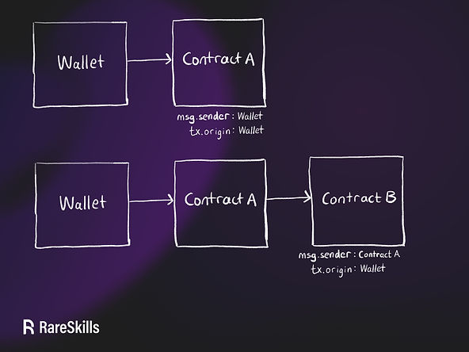

# [contract-codes](https://www.rareskills.io/post/solidity-code-length)
判断是否是合约地址的三种方式
- `msg.sender==tx.origin`
- `EXTCODESIZE` 读取 `code.length` 
- `EXTCODEHASH` 读取 `code.hash`
## msg.sender==tx.origin
- `tx.origin` 是当前交易的签名地址
- `msg.sender` 是当前 `EVM` 执行环境中的交易发送地址
- 对于 `EOA` 直接发起的的合约交易，合约内部：`msg.sender==tx.origin`
- 合约之间外部调用重启 `EVM` 执行环境的外部调用：`msg.sender!=tx.origin`

## EXTCODESIZE
- `codeSize = 0`, 不表示该地址一定是 `EOA` 地址
  - 有可能是预定义的 `create2` 地址，未来会部署成为合约
  - 对方在 `constructor()` 中调用 `call` 交易，此时合约未存储上链，`codeSize = 0`
- [selfdestruct](./contracts-destroy.md)在 `dencun` 升级后并不会清除合约状态和代码，因此 codeSize != 0
## Solidity Examples
```solidity
// SPDX-License-Identifier: MIT
pragma solidity ^0.8.20;

contract TestAddressSize {
    event codeSize(uint256);

    function constructorCodeSize() external {
        uint256 codes;
        address sender = msg.sender;
        assembly {
            codes := extcodesize(sender)
        }
        emit codeSize(codes);
    }

    // 765 gas
    function codesize(address target) public view returns (bool isContract) {
        if (target.code.length == 0) {
            isContract = false;
        } else {
            isContract = true;
        }
    }

    // 779 gas
    function codesizeAssm(address target) public view returns (bool) {
        uint256 size;
        assembly {
            size := extcodesize(target)
        }
        return size != 0;
    }
}

contract onlyConstructor {
    constructor() {
        address addr = 0x10E2fC1dE57DDC788489122151a6c45254D3ba59;
        (bool success, ) = addr.call(
            abi.encodeWithSignature("constructorCodeSize()")
        );
        if (!success) {
            revert();
        }
    }
    // [
    // 	{
    // 		"from": "0x10E2fC1dE57DDC788489122151a6c45254D3ba59",
    // 		"topic": "0x35bbf8dac6652434e49dd256e75001562f8cabc9ab024b4ed3f7826b3ab5a81f",
    // 		"event": "codeSize",
    // 		"args": {
    // 			"0": "0"
    // 		}
    // 	}
    // ]
}

contract afterSelfDestruct {
    function deposit() external payable {}

    // 销毁后并不会影响合约的使用
    // 销毁保留合约的状态的代码
    // 销毁仅仅是强制将合约余额转出
    function kill() external {
        selfdestruct(payable(msg.sender));
    }
}
```
## EXTCODEHASH
- 返回 `keccak256(codes)`
- 如果地址 `balance == 0 && codeSize == 0`, 返回 `bytes32(0)`
- 如果地址 `balance != 0 && codeSize == 0`, 返回 `keccak256(""")=0xc5d2460186f7233c927e7db2dcc703c0e500b653ca82273b7bfad8045d85a470`
- 如果地址 `codeSize != 0`, 返回 `keccak256(codes)`
- 全部 [预编译](../Milestone3/contracts-precompile.md)合约预存 `1wei`,因此会返回空值的 `hash`
```solidity
// SPDX-License-Identifier: MIT
pragma solidity ^0.8.20;

contract TestAddressSize {
    event codeHash(bytes32);

    function constructorCodeHash() external {
        bytes32 codehashs;
        address sender = msg.sender;
        assembly {
            codehashs := extcodehash(sender)
        }
        emit codeHash(codehashs);
    }

    //  gas
    function codehash(address target) public view returns (bytes32 hash) {
        hash = target.codehash;
    }

    //  gas
    function codesizeAssm(address target) public view returns (bytes32 hash) {
        assembly {
            hash := extcodehash(target)
        }
    }
}

contract onlyConstructor {
    //0x0000000000000000000000000000000000000000000000000000000000000000
    constructor() {
        address addr = 0x16a90f9ec7A46514b47487bDc2F00d11740c3BA0;
        (bool success, ) = addr.call(
            abi.encodeWithSignature("constructorCodeSize()")
        );
        if (!success) {
            revert();
        }
    }
}

contract afterSelfDestruct {
    function deposit() external payable {}

    // before kill: 0xd0516dff3313077772b6176aa83c5ad4da898b2f66e2dd058b612dbace072fbc
    // after kill: 0xd0516dff3313077772b6176aa83c5ad4da898b2f66e2dd058b612dbace072fbc
    // 销毁后并不会影响合约的使用
    // 销毁保留合约的状态的代码
    // 销毁仅仅是强制将合约余额转出
    function kill() external {
        selfdestruct(payable(msg.sender));
    }
}
```
## 判断地址是否是合约地址
```solidity
// SPDX-License-Identifier: MIT

pragma solidity ^0.8.0;

library ContractAddress {
    function isContract(address contractAddress) internal view returns (bool) {
        bytes32 existingCodeHash = contractAddress.codehash;

        // https://eips.ethereum.org/EIPS/eip-1052
        // keccak256('') == 0xc5d2460186f7233c927e7db2dcc703c0e500b653ca82273b7bfad8045d85a470
        return
            existingCodeHash != bytes32(0) &&
            existingCodeHash != 0xc5d2460186f7233c927e7db2dcc703c0e500b653ca82273b7bfad8045d85a470;
    }
}
```

## 获取地址的合约codes
```solidity
library GetCode {
    function at(address _addr) public view returns (bytes memory o_code) {
        assembly {
            // retrieve the size of the code, this needs assembly
            let size := extcodesize(_addr)
            // allocate output byte array - this could also be done without assembly
            // by using o_code = new bytes(size)
            o_code := mload(0x40)
            // new "memory end" including padding
            mstore(0x40, add(o_code, and(add(add(size, 0x20), 0x1f), not(0x1f))))
            // store length in memory
            mstore(o_code, size)
            // actually retrieve the code, this needs assembly
            extcodecopy(_addr, add(o_code, 0x20), 0, size)
        }
    }
}
```
假设：
- _addr 地址的代码大小是 size = 45 字节
- 当前空闲内存指针 mload(0x40) = 0x80

1. 获取合约code的size
```solidity
let size := extcodesize(_addr)
```
2. 获取当前内存的空闲位置
```solidity
o_code := mload(0x40)
```
```scss
┌───────────────┬─────────────┐
│ 地址          │ 内容        │
├───────────────┼─────────────┤
│ 0x40          │ 0x80        │ ← 当前空闲内存指针
│ o_code = 0x80 │ 分配起点     │
└───────────────┴─────────────┘
```
3. 更新空闲内存的起始位置（防止数据重写覆盖）
```solidity
mstore(0x40, add(o_code, and(add(add(size, 0x20), 0x1f), not(0x1f))))
```
```json
size = 45
size + 0x20 = 77      ← 加上 bytes 头
+ 0x1f     = 108       ← 向上对齐所需的偏移
& ~0x1f    = 0x60     ← 清除低 5 位，变成 32 字节对齐（0x60 = 96）

new_free_ptr = o_code + 96 = 0x80 + 0x60 = 0xE0
```
```scss
┌───────────────┬─────────────┐
│ 地址          │ 内容        │
├───────────────┼─────────────┤
│ 0x40          │ 0xE0        │ ← 更新后的空闲指针
└───────────────┴─────────────┘
```
4. 将合约codes size写入当前获取的内存位置
```solidity
mstore(o_code, size)
```
```scss
┌───────────────┬────────────────────┐
│ 地址          │ 内容               │
├───────────────┼────────────────────┤
│ 0x80          │ 0x2D (45 十进制)   │ ← bytes 长度头
└───────────────┴────────────────────┘
```
5. 拷贝代码到内存中
```solidity
extcodecopy(_addr, add(o_code, 0x20), 0, size)
```
```scss
┌───────────────┬────────────────────────────┐
│ 地址          │ 内容                       │
├───────────────┼────────────────────────────┤
│ 0x80          │ 0x2D (长度 45)             │ ← 数组头
│ 0xA0          │ 字节码第1字节              │
│ 0xA1          │ 字节码第2字节              │
│ ...           │ ...                        │
│ 0xA0 + 2C     │ 字节码第45字节             │
└───────────────┴────────────────────────────┘
```
6. 最终内存布局
```scss
[0x80]      ← o_code
↓
┌────────────┬────────────────────────────┐
│ 偏移       │ 内容                       │
├────────────┼────────────────────────────┤
│ 0x00       │ length = 45                │
│ 0x20       │ bytecode[0]                │
│ 0x21       │ bytecode[1]                │
│ ...        │ ...                        │
│ 0x4C       │ bytecode[44]               │
│ 0xE0       │ 下一个空闲内存指针         │ ← 对齐后更新到 0x40
└────────────┴────────────────────────────┘
```
### 最终获取数据是为什么 +0x20
在 Solidity 中，bytes/string 在内存中的布局如下：

| offset | 内容                  |
|--------|-----------------------|
| 0x00   | 数组长度（32 字节）   |
| 0x20   | 第一个字节（data[0])  |
| 0x21   | 第二个字节（data[1])  |
| ...    | 后续数据               |

- o_code 是内存中动态字节数组的起始地址。 
- 该地址的前 32 字节存储的是数组的 长度（也就是字节码的大小）。 
- 实际数据（bytecode）从 o_code + 0x20 开始。

内存分配为：
```yaml
0x80:  [  0x64 = 100 ]     ← 数组长度
0xA0:  [ byte 0   ]        ← 字节码实际开始位置
0xA1:  [ byte 1   ]
...
0xA0 + 100: [结束]
```
### 为什么需要重新定义空闲内存的起始位置
```solidity
mstore(0x40, add(o_code, and(add(add(size, 0x20), 0x1f), not(0x1f))))
```
🧠 这句做了什么？
它的作用是：

✅ 更新 `Solidity` 的“空闲内存指针”，保存在位置 `0x40`。

这是 `Solidity` 的一个隐式规范，告诉编译器从哪里开始安全地分配新的内存。

内存从地址 `0x80` 开始，位置 `0x40` 是一个特殊的地方，约定用于存储“下一个空闲内存地址”。

🧨 如果你删除了这一句会怎样？
不立即报错，但未来可能造成严重问题：

✅ 当前函数内部看起来可能没有问题，因为你已经分配好了内存。

❌ 一旦后续函数或 `Solidity` 内部逻辑要再用 `mload(0x40)` 分配内存，就会错误地覆盖你之前写的内容！

❌ 如果你返回 `bytes memory` 或多个动态变量，编译器会依赖这个指针进行新分配。

❌ 在 `Yul`、`inline` `assembly`、或 `ABI` 编码中，这个指针非常关键，不能留错！

举个直观例子：

```solidity
bytes memory a = at(someAddress);
bytes memory b = new bytes(32);  // 编译器使用 mload(0x40) 分配新内存
```
如果没更新 `0x40`，b 就可能直接覆盖 a 的内容！

🧩 分两种情况对比：

✅ 正确做法（更新了 0x40）

图示：内存状态
```kotlin
┌────────────┬────────────────────────────┐
│ 地址       │ 内容                       │
├────────────┼────────────────────────────┤
│ 0x40       │ 0xE0 ← ✅ 新的空闲地址      │ ← mstore(0x40, ...)
│ 0x80       │ a.length = 45              │ ← o_code
│ 0xA0       │ a.data[0]                  │
│ ...        │ ...                        │
│ 0xE0       │ b.length = 32              │ ← 新的 b
│ 0x100      │ b.data[0]                  │
└────────────┴────────────────────────────┘
```
✅ 一切按规则对齐，数据干净。

❌ 错误做法（删除了 mstore(0x40, ...)）

图示：内存状态
```kotlin
┌────────────┬────────────────────────────┐
│ 地址       │ 内容                       │
├────────────┼────────────────────────────┤
│ 0x40       │ 0x80 ← 😱 没有更新空闲指针 │ ← mload(0x40) 仍为旧值
│ 0x80       │ a.length = 45              │ ← o_code
│ 0xA0       │ a.data[0]                  │
│ ...        │ ...                        │
│ 0x80       │ b.length = 32              │ ← b 从同一地址分配
│ 0xA0       │ b.data[0]                  │
└────────────┴────────────────────────────┘
```

💥 结果：

- b 分配的内存覆盖了 a 的数据 
- 后续读取 a 会出现乱码或不一致
- 更严重时可能导致合约行为错误、ABI 解析失败

📉 可能的现象：

| 输出         | 正确写法      | 错误写法                      |
| ---------- | --------- | ------------------------- |
| `a.length` | 正确值（如 45） | 被 `b.length = 32` 覆盖变成 32 |
| `a[0]`     | 字节码首字节    | 被覆盖可能变为 0x00              |
| `b[0]`     | 正常值       | 正常值                       |
| 内存布局       | 分开        | 重叠，数据冲突                   |

### 向上对齐到32字节边界?
```solidity
and(add(add(size, 0x20), 0x1f), not(0x1f))
```
1. 背景：内存对齐
在 `EVM` 里，内存分配通常以 `32` 字节 为单位（一个字槽 `word` 大小），对齐内存是为了：

避免跨槽读写带来的性能和安全问题

保持内存布局规范，方便 `Solidity` 编译器和 `ABI` 解析

2. 具体操作
上面操作等价于 `aligned_size = (size + 32 + 31) & (~31)`

分解
- size + 32 ：给数据加上 32 字节的头部空间（bytes 的长度字段）

  | 操作        | 功能描述             |
  | --------- | ---------------- |
  | `+ 0x1f`  | 让非32的倍数“凑满一整块”   |
  | `& ~0x1f` | 清除低5位，确保是32的倍数对齐 |
