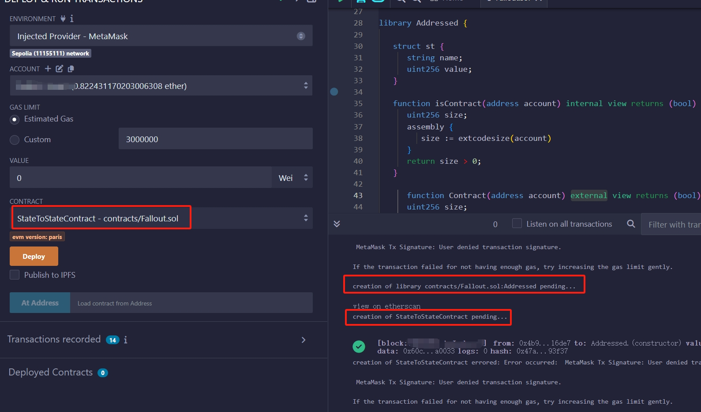

# 库合约
- 库合约使用<kbd>library</kbd>关键字修饰
- 库合约作为完整函数的封包使用
- 库合约不能接收token 
- 库合约不能被继承或继承别的合约 
- 库合约不能存在状态变量
- 库合约不能定义构造函数
- 库合约的使用分为两种： 
  - 通过 `Using library_name for type`,此时 `type` 类型的变量就可以调用库合约内部函数
  - 直接通过 `library_name` 调用函数

## 库合约修饰符
1. 仅带有 `Internal` 修饰符的库合约函数代码直接被编码到执行合约中，通过 `jump` 跳转执行
2. 带有 `external` 修饰符的库合约，必须先被部署在链上，在将链上的库合约地址 编码到执行合约，执行合约通过 `delegateCall` 库合约
3. `DelegateCall` 比 `jump` 跳转执行花费更多的 `gas`
4. 并且带有 `external` 函数的库合约必须先部署在链上，也需要额外的合约部署成本


## Solidity Library Internal Function Example
- 仅使用 `internal` 修饰的 `library` 合约不需要被部署到区块链上
- 库合约的内部函数被编码到当前执行合约中，直接 `jump` 到当前代码执行

Example: `ContractsA` 使用 库合约 `LibInternal` 中的 `FuncA`
> 编译合约 ContractA
> 
> 编译库合约 LibInternal
> 
> 库合约中的 funcA bytecode 被复制编码到 ContractA bytecode
> 
> ContractA bytecode 部署到链上
>
> ContractA 调用 FuncA 的方式和自己内部函数一样，执行 selector 匹配 以及jump 跳转

## Solidity Library External Function Example
- 调用任一带有 `external` 修饰的 `library` 合约函数，必须先把库合约部署到区块链上
- 执行合约通过 `delegateCall` 调用库合约函数中的 `external` 函数

Example: `ContractsB` 调用库合约 `LibInternal` 中的 `External` 修饰的 `FuncA`
> 编译合约 ContractB
> 
> 编译库合约 LibExternal
> 
> LibExternal 首先被部署到链上
> 
> ContractB bytecode 中嵌入库合约地址，方便后续执行 delegateCall 调用
> 
> ContractB 被部署到链上
>



```solidity
// SPDX-License-Identifier: MIT
pragma solidity ^0.8.26;

library Address {
   struct st {
      string name;
      uint256 value;
   }

   function isContract(address account) internal view returns (bool) {
      uint256 size;
      assembly {
         size := extcodesize(account)
      }
      return size > 0;
   }
}

contract StateToStateContract {
   using Address for address;

   function isSC(address _addr) public view returns (bool) {
      return Address.isContract(_addr); //_addr.isContract();
   }
}
```

## preference
[Difference of internal and external library](https://eip2535diamonds.substack.com/p/the-difference-between-solidity-libraries)
