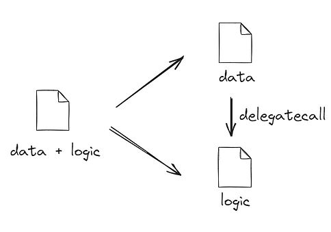
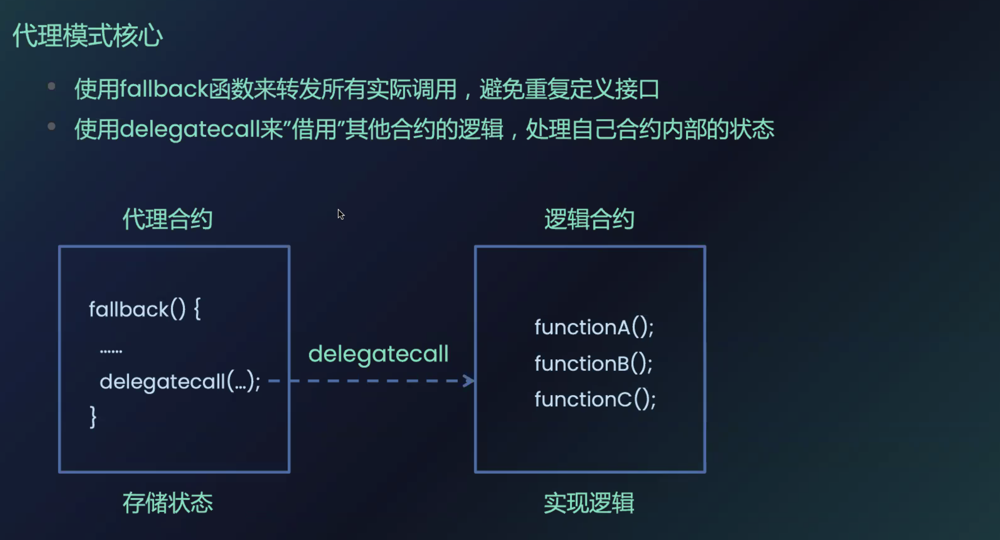
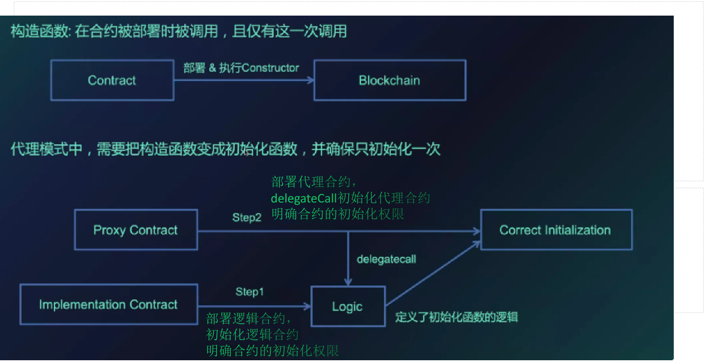
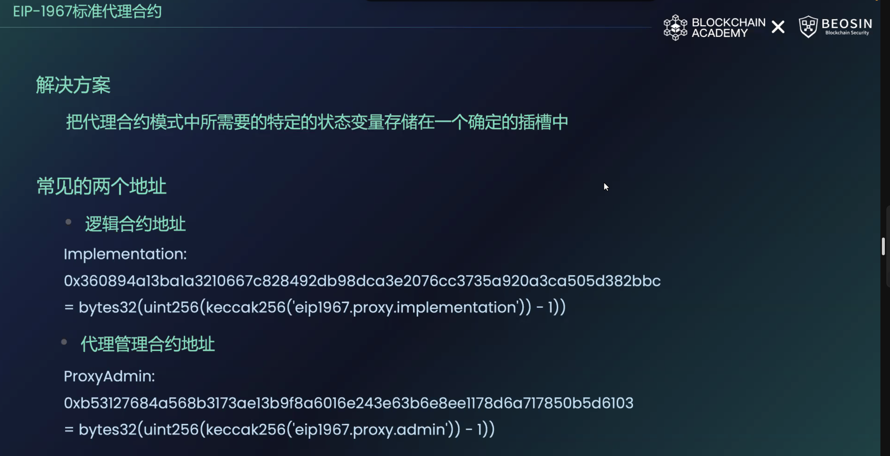
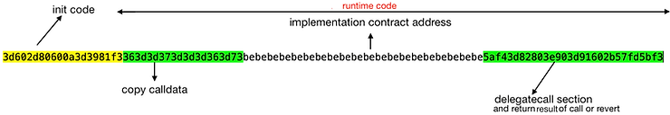
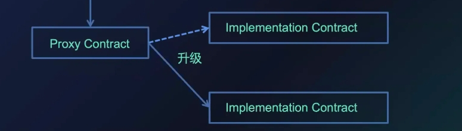
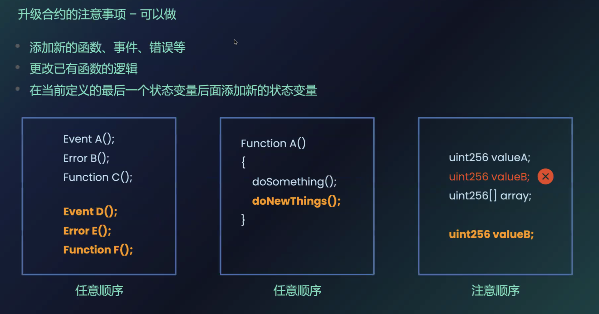
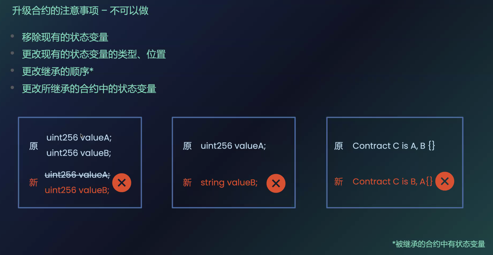
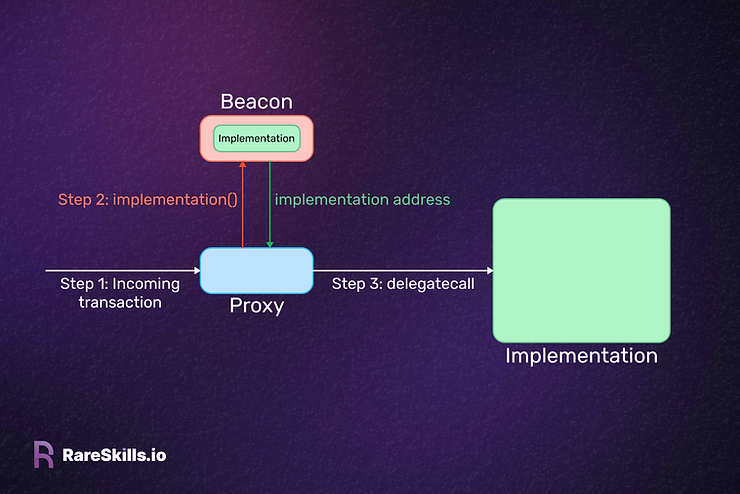

# 代理合约
- 代理合约底层采用 [delegateCall](./contracts-delegatecall.md),分离逻辑和数据。
- 由于逻辑和数据分离，后续可以灵活替换逻辑业务
- 代理合约按照逻辑合约代码去更新/读取 `EVM` 环境中的 `slot` 的状态变量
    - 因此替换逻辑合约时，应该保持 `slot` 的状态变量的顺序
    - 新增参数只能在末端添加



## 代理合约逻辑
- 用户直接对接代理合约，代理合约存储合约数据 
  - 代理合约 `delegateCall` 调用逻辑合约，只能更改代理合约内部的状态变量
- 逻辑合约仅仅负责代理合约数据处理的逻辑
  - 逻辑合约的数据不受代理合约的影响
- 因此，需要独立初始化代理合约和逻辑合约的内部参数


## 代理合约[插槽](https://github.com/OpenZeppelin/openzeppelin-contracts/blob/master/contracts/proxy/ERC1967/ERC1967Utils.sol#L21)存储
>This is the keccak-256 hash of "eip1967.proxy.implementation" subtracted by 1.
> 
>bytes32 internal constant IMPLEMENTATION_SLOT = 0x360894a13ba1a3210667c828492db98dca3e2076cc3735a920a3ca505d382bbc;
> 
> This is the keccak-256 hash of "eip1967.proxy.admin" subtracted by 1.
> 
>bytes32 internal constant ADMIN_SLOT = 0xb53127684a568b3173ae13b9f8a6016e243e63b6e8ee1178d6a717850b5d6103;


## 最简代理合约（不可升级clone）


[最小代理](https://www.rareskills.io/post/eip-1167-minimal-proxy-standard-with-initialization-clone-pattern)基于[EIP1167](https://eips.ethereum.org/EIPS/eip-1167),由三部分组成:
- 最开始的10 bytes 表示 `initcode`，用来部署最小代理合约
### InitCodes
```text
// copy the runtime bytecode of the minimal proxy 
// starting from offset 10, and save it to the blockchain

3d [00] RETURNDATASIZE	
60 [01] PUSH1    2d
80 [03] DUP1	

//push 10 - offset to copy runtime code from
60 [04] PUSH1    0a     
3d [06] RETURNDATASIZE	

// copy the runtime code and save it to the blockchain
39 [07] CODECOPY // 表示偏移量为0x0a = 10 bytes, 拷贝 0x2d = 45bytes 的 runtimeCodes
81 [08] DUP2	
f3 [09] RETURN
```
### RuntimeCodes
```text
|           0x00000000      36             calldatasize          cds
|           0x00000001      3d             returndatasize        0 cds
|           0x00000002      3d             returndatasize        0 0 cds
|           0x00000003      37             calldatacopy          
|           0x00000004      3d             returndatasize        0
|           0x00000005      3d             returndatasize        0 0 
|           0x00000006      3d             returndatasize        0 0 0
|           0x00000007      36             calldatasize          cds 0 0 0
|           0x00000008      3d             returndatasize        0 cds 0 0 0
|           0x00000009      73bebebebebe.  push20 0xbebebebe     0xbebe 0 cds 0 0 0
|           0x0000001e      5a             gas                   gas 0xbebe 0 cds 0 0 0
|           0x0000001f      f4             delegatecall          suc 0
|           0x00000020      3d             returndatasize        rds suc 0
|           0x00000021      82             dup3                  0 rds suc 0
|           0x00000022      80             dup1                  0 0 rds suc 0
|           0x00000023      3e             returndatacopy        suc 0
|           0x00000024      90             swap1                 0 suc
|           0x00000025      3d             returndatasize        rds 0 suc
|           0x00000026      91             swap2                 suc 0 rds
|           0x00000027      602b           push1 0x2b            0x2b suc 0 rds
|       ,=< 0x00000029      57             jumpi                 0 rds
|       |   0x0000002a      fd             revert
|       `-> 0x0000002b      5b             jumpdest              0 rds
\           0x0000002c      f3             return
```

其中，`runtime` `bytecodes` `363d3d373d3d3d363d73bebebebebebebebebebebebebebebebebebebebe5af43d82803e903d91602b57fd5bf3` 占据 45 `bytes`

合约创建允许的最大为 24576 `bytes`，因此在创建代理合约时的传参 `size` 必须小于 24531

```solidity
    function _cloneCodeWithImmutableArgs(
        address implementation,
        bytes memory args
    ) private pure returns (bytes memory) {
        if (args.length > 24531) revert CloneArgumentsTooLong();
        return
            abi.encodePacked(
                hex"61",
                uint16(args.length + 45),
                hex"3d81600a3d39f3363d3d373d3d3d363d73",
                implementation,
                hex"5af43d82803e903d91602b57fd5bf3",
                args
            );
    }
```

### examples

```solidity
contract CloneFactory {

  function createClone(address target) internal returns (address result) {
    bytes20 targetBytes = bytes20(target);
    assembly {
      let clone := mload(0x40)
      mstore(clone, 0x3d602d80600a3d3981f3363d3d373d3d3d363d73000000000000000000000000)
      mstore(add(clone, 0x14), targetBytes)
      mstore(add(clone, 0x28), 0x5af43d82803e903d91602b57fd5bf30000000000000000000000000000000000)
      result := create(0, clone, 0x37) //0x14 + 0x14 + 0x0f
    }
  }

  function isClone(address target, address query) internal view returns (bool result) {
    bytes20 targetBytes = bytes20(target);
    assembly {
      let clone := mload(0x40)
      mstore(clone, 0x363d3d373d3d3d363d7300000000000000000000000000000000000000000000)
      mstore(add(clone, 0xa), targetBytes)
      mstore(add(clone, 0x1e), 0x5af43d82803e903d91602b57fd5bf30000000000000000000000000000000000)

      let other := add(clone, 0x40)
      extcodecopy(query, other, 0, 0x2d)
      result := and(
        eq(mload(clone), mload(other)),
        eq(mload(add(clone, 0xd)), mload(add(other, 0xd)))
      )
    }
  }
}
```
## 简单可升级代理合约实现
### 逻辑合约地址
- [eip1967](https://www.rareskills.io/post/erc1967) 允许函数更新 `IMPLEMENTATION_SLOT` 数据 (严格的权限控制),
### initialize 
- 一般情况下，逻辑合约定义 `initialize()` 函数，按照插槽顺序初始化代理合约数据
  - 但是需要注意： `initialize()` 应该只能调用一次,或者拥有严格的权限控制
  - 代理合约的初始化不会影响逻辑合约的状态变量
  - 逻辑合约必须单独执行数据的初始化，并确保逻辑合约中的初始化只能调用一次,或者拥有严格的权限控制
```solidity
// SPDX-License-Identifier: MIT

pragma solidity ^0.8.19;

import "erc721a/contracts/extensions/ERC721ABurnable.sol";
import "@openzeppelin/contracts/access/Ownable.sol";

import "@openzeppelin/contracts/proxy/ERC1967/ERC1967Proxy.sol";
import "@openzeppelin/contracts/access/Ownable.sol";

contract LogisNFT is Ownable, ERC721ABurnable {
    bool public mintable;
    uint256 public maxSupply;
    uint256 private initilaized;
    address private launchcaller;
    // Current base URI.
    string public currentBaseURI;
    // The suffix for the token URL, e.g. ".json".
    string private tokenURISuffix;
    string private nftname;
    string private nftsymbol;
    error NotMintable();

    constructor() payable ERC721A(nftname, nftsymbol) Ownable(_msgSender()) {
        initilaized = 1;
    }

    function initailize(
        string memory _name,
        string memory _symbol,
        string memory _tokenURISuffix,
        string memory _currentBaseURI,
        uint256 _maxSupply,
        address _caller
    ) public virtual {
        require((initilaized == 0), "ALREADY_INITIALIZED");
        nftname = _name;
        nftsymbol = _symbol;
        tokenURISuffix = _tokenURISuffix;
        currentBaseURI = _currentBaseURI;
        maxSupply = _maxSupply;
        launchcaller = _caller;
        initilaized = 1;
    }

    /**
     * @dev Returns the token collection name.
     */
    function name()
        public
        view
        virtual
        override(ERC721A, IERC721A)
        returns (string memory)
    {
        return nftname;
    }

    /**
     * @dev Returns the token collection symbol.
     */
    function symbol()
        public
        view
        virtual
        override(ERC721A, IERC721A)
        returns (string memory)
    {
        return nftsymbol;
    }

    /**
     * @dev Returns the address of the current owner.
     */
    function caller() public view virtual returns (address) {
        return launchcaller;
    }

    /**
     * @dev Sets mintable.
     */
    function setMintable(bool _mintable) external onlyOwner {
        mintable = _mintable;
    }
}

contract ProxyBase is ERC1967Proxy, Ownable {
    constructor(
        address implementation,
        bytes memory _data,
        address _owner
    ) ERC1967Proxy(implementation, _data) Ownable(_owner) {}

    function implement() external view returns (address) {
        return _implementation();
    }

    function upgradeImpl(address implementation, bytes memory _data)
        public
        virtual
        onlyOwner
    {
        ERC1967Utils.upgradeToAndCall(implementation, _data);
    }

    function renounceOwnership() public view override onlyOwner {
        revert("CLOSED_INTERFACE");
    }

    receive() external payable {}
}

contract Factory is Ownable {
    address[] public proxys;
    event ProxyCreated(address indexed _account);

    constructor() Ownable(_msgSender()) {}

    function newproxy(
        address implementation,
        string memory _name,
        string memory _symbol,
        string memory _tokenURISuffix,
        string memory _currentBaseURI,
        uint256 _maxSupply,
        address _caller,
        address _owner
    ) external onlyOwner {
        bytes memory _data = abi.encodeWithSignature(
            "initailize(string,string,string,string,uint256,address)",
            _name,
            _symbol,
            _tokenURISuffix,
            _currentBaseURI,
            _maxSupply,
            _caller
        );
        ProxyBase proxy = new ProxyBase(implementation, _data, _owner);
        proxys.push(address(proxy));
        emit ProxyCreated(address(proxy));
    }

    function renounceOwnership() public view override onlyOwner {
        revert("CLOSED_INTERFACE");
    }
}
```
### 合约升级


- 代理合约直接 `delegateCall` 逻辑合约
- 按照逻辑合约的代码更新 代理合约 `EVM slot` 数据

因此，合于升级后不能影响旧的状态变量相对顺序
- 合约升级只能添加新的函数、事件、`error`、结构体、`immutable|constant` 变量
- 合约升级允许更新函数逻辑
- 合约升级可以在最后添加新的状态变量，确保旧状态变量的顺序
- 合约升级不能更改状态变量顺序、不能继承新的合约（会改变状态变量顺序）



## [beacon](https://github.com/OpenZeppelin/openzeppelin-contracts/blob/master/contracts/proxy/beacon/BeaconProxy.sol)代理合约
1. 多个代理合约使用同一个逻辑合约,并且通过单笔交易可以升级多个代理合约的逻辑合约地址
2. 适用于一个逻辑产生多个衍生合约的场景（班级学生采用同一个逻辑管理，但是每人拥有各自的状态）
### beacon合约
- `beacon` 合约作为灯塔，提供当前 `implementation` 地址
- 全部代理合约去 `beacon` 合约读取逻辑合约地址，发送 `delegateCall` 交易


- 更换新的逻辑合约后，只需要更新 `beacon` 合约的 `IMPLEMENTATION_SLOT` 数据，就可以实现 `all proxy` 的逻辑地址更新


```solidity
// SPDX-License-Identifier: MIT

pragma solidity ^0.8.19;

import "erc721a/contracts/extensions/ERC721ABurnable.sol";
import "@openzeppelin/contracts/access/Ownable.sol";
import "@openzeppelin/contracts/proxy/beacon/BeaconProxy.sol";
import "@openzeppelin/contracts/proxy/beacon/UpgradeableBeacon.sol";
import "@openzeppelin/contracts/access/Ownable.sol";

contract LogisNFT is Ownable, ERC721ABurnable {
    bool public mintable;
    uint256 public maxSupply;
    uint256 private initilaized;
    address private launchcaller;
    // Current base URI.
    string public currentBaseURI;
    // The suffix for the token URL, e.g. ".json".
    string private tokenURISuffix;
    string private nftname;
    string private nftsymbol;
    error NotMintable();

    constructor() payable ERC721A(nftname, nftsymbol) Ownable(_msgSender()) {
        initilaized = 1;
    }

    function initailize(
        string memory _name,
        string memory _symbol,
        string memory _tokenURISuffix,
        string memory _currentBaseURI,
        uint256 _maxSupply,
        address _caller
    ) public virtual {
        require((initilaized == 0), "ALREADY_INITIALIZED");
        nftname = _name;
        nftsymbol = _symbol;
        tokenURISuffix = _tokenURISuffix;
        currentBaseURI = _currentBaseURI;
        maxSupply = _maxSupply;
        launchcaller = _caller;
        initilaized = 1;
    }

    /**
     * @dev Returns the token collection name.
     */
    function name()
    public
    view
    virtual
    override(ERC721A, IERC721A)
    returns (string memory)
    {
        return nftname;
    }

    /**
     * @dev Returns the token collection symbol.
     */
    function symbol()
    public
    view
    virtual
    override(ERC721A, IERC721A)
    returns (string memory)
    {
        return nftsymbol;
    }

    /**
     * @dev Returns the address of the current owner.
     */
    function caller() public view virtual returns (address) {
        return launchcaller;
    }

    /**
     * @dev Sets mintable.
     */
    function setMintable(bool _mintable) external onlyOwner {
        mintable = _mintable;
    }
}

// 管理Implementation
contract Beacon is UpgradeableBeacon {
    constructor(address implementation_)
    UpgradeableBeacon(implementation_, _msgSender())
    {}
}

// 管理beacon,用户直接交互的合约
// address private immutable _beacon;
// beacon地址不允许更新，值直接写到合约codes,读取的一直是合约codes中初始化的那个值
// Factory产生的子合约
contract ProxyBase is BeaconProxy, Ownable {
    constructor(
        address beacon,
        bytes memory data, // delegateCall implementation()'s address
        address _owner
    ) BeaconProxy(beacon, data) Ownable(_owner) {}

    function implement() external view returns (address) {
        return _implementation();
    }

    function renounceOwnership() public view override onlyOwner {
        revert("CLOSED_INTERFACE");
    }

    function getBeacon() external view returns (address) {
        return _getBeacon();
    }

    receive() external payable {}
}

contract Factory is Ownable {
    address[] public proxys;
    event ProxyCreated(address indexed _account);

    constructor() Ownable(_msgSender()) {}

    function newproxy(
        address beacon,
        string memory _name,
        string memory _symbol,
        string memory _tokenURISuffix,
        string memory _currentBaseURI,
        uint256 _maxSupply,
        address _caller,
        address _owner
    ) external onlyOwner {
        bytes memory _data = abi.encodeWithSignature(
            "initailize(string,string,string,string,uint256,address)",
            _name,
            _symbol,
            _tokenURISuffix,
            _currentBaseURI,
            _maxSupply,
            _caller
        );
        ProxyBase proxy = new ProxyBase(beacon, _data, _owner);
        proxys.push(address(proxy));
        emit ProxyCreated(address(proxy));
    }

    function renounceOwnership() public view override onlyOwner {
        revert("CLOSED_INTERFACE");
    }
}
```
