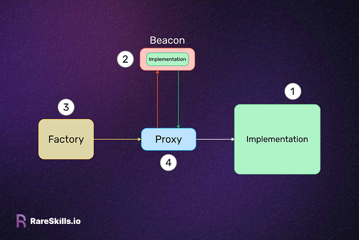

# 代理合约
- 代理合约底层采用 [delegateCall](./contracts-delegatecall.md),分离业务逻辑和数据存储。
- 由于业务和数据分离，后续可以灵活替换逻辑业务
- 代理合约按照业务合约代码去更新/读取 `EVM` 环境中的 `slot` 的状态变量
    - 因此替换业务合约时，应该保持 `slot` 的状态变量的顺序
    - 新增参数只能在末端添加


## 代理合约逻辑
- 用户直接对接代理合约，代理合约存储合约数据
- 代理合约 `delegateCall` 调用逻辑合约，只能更改数据合约内部的状态变量
- 逻辑合约的数据不受代理合约的影响
- 逻辑合约控制整个代理合约数据处理的逻辑
- 因此，代理合约和逻辑合约两部分合约内部参数的初始化，需要独立执行，各自数据并不互通

## 代理合约[插槽](https://github.com/OpenZeppelin/openzeppelin-contracts/blob/master/contracts/proxy/ERC1967/ERC1967Utils.sol#L21)存储
>This is the keccak-256 hash of "eip1967.proxy.implementation" subtracted by 1.
> 
>bytes32 internal constant IMPLEMENTATION_SLOT = 0x360894a13ba1a3210667c828492db98dca3e2076cc3735a920a3ca505d382bbc;
> 
> This is the keccak-256 hash of "eip1967.proxy.admin" subtracted by 1.
> 
>bytes32 internal constant ADMIN_SLOT = 0xb53127684a568b3173ae13b9f8a6016e243e63b6e8ee1178d6a717850b5d6103;

## 最简代理合约（不可升级clone）
[最小代理](https://www.rareskills.io/post/eip-1167-minimal-proxy-standard-with-initialization-clone-pattern)基于[EIP1167](https://eips.ethereum.org/EIPS/eip-1167),由三部分组成:
- `initcode`,拷贝 `calldata` 数据
- 指定逻辑合约地址
- 执行 `delegateCall`,返回执行结果或者失败 `revert`

### examples
```solidity
// SPDX-License-Identifier: MIT
pragma solidity >=0.7.0 <0.9.0;
import "@openzeppelin/contracts/utils/Create2.sol";

contract Factory {
    error AccountCreationFailed();
    error InvalidSignerInput();
    error InvalidOwnerInput();
    error DuplicatedAddress();
    event AccountCreated(address indexed _account);

    address[] public userwallet;
    address public implementation;
    address public manager;
    address public owner;
    mapping(string => address) identiWallet;

    function getWalletLength() public view returns (uint256) {
        return userwallet.length;
    }

    constructor(address _manager, address _implement) payable {
        owner = msg.sender;
        manager = _manager;
        implementation = _implement;
    }

    modifier onlyOwner() {
        require(msg.sender == owner, "NOT_OWNER");
        _;
    }

    modifier onlyManager() {
        require(msg.sender == manager, "NOT_OWNER");
        _;
    }

    function updateOwner(address newOwner) external onlyOwner {
        require(
            newOwner != address(0) && newOwner != owner,
            "DUP/INVALID_NEWOWNER"
        );
        owner = newOwner;
    }

    function updateManager(address newManager) external onlyOwner {
        require(
            newManager != address(0) && newManager != manager,
            "DUP/INVALID_NEWMANAGER"
        );
        manager = newManager;
    }

    function updateImpl(address newImpl) external onlyOwner {
        require(
            newImpl != address(0) && newImpl != implementation,
            "DUP/INVALID_NEWIMPL"
        );
        implementation = newImpl;
    }

    function getCreationCode(bytes32 _identifier)
    internal
    view
    returns (bytes memory)
    {
        return
            abi.encodePacked(
            hex"3d60ad80600a3d3981f3363d3d373d3d3d363d73",
            implementation,
            hex"5af43d82803e903d91602b57fd5bf3",
            abi.encode(_identifier)
        );
    }

    function createAccount(
        address _owner,
        address _signer,
        string memory _identifier
    ) external onlyManager returns (address _account) {
        (bytes memory code, bytes memory salt) = checkAccount(
            _owner,
            _signer,
            _identifier
        );

        assembly {
            _account := create2(0, add(code, 0x20), mload(code), salt)
        }
        if (_account == address(0)) revert AccountCreationFailed();
        emit AccountCreated(_account);
        (bool success, bytes memory result) = _account.call(
            abi.encodeWithSignature(
                "initData(address,address,address)",
                _owner,
                manager,
                _signer
            )
        );
        if (!success) {
            assembly {
                revert(add(result, 32), mload(result))
            }
        }
        identiWallet[_identifier] = _account;
        userwallet.push(_account);
    }

    function checkAccount(
        address _owner,
        address _signer,
        string memory _identifier
    ) internal view returns (bytes memory code, bytes memory salt) {
        if (_owner == address(0)) revert InvalidOwnerInput();
        if (_signer == address(0)) revert InvalidSignerInput();
        require(
            identiWallet[_identifier] == address(0),
            "ONLY_ALLOW_ONE_WALLET"
        );
        code = getCreationCode(convertStringToByte32(_identifier));
        salt = abi.encode(_identifier, _owner, _signer);
        address _account = Create2.computeAddress(
            bytes32(salt),
            keccak256(code)
        );
        if (_account.code.length != 0) revert DuplicatedAddress();
    }

    function account(
        address _owner,
        address _signer,
        string memory _identifier
    ) external view returns (address _account) {
        bytes memory code = getCreationCode(convertStringToByte32(_identifier));
        bytes memory salt = abi.encode(_identifier, _owner, _signer);
        _account = Create2.computeAddress(bytes32(salt), keccak256(code));
        return _account;
    }

    function convertStringToByte32(string memory _texte)
    internal
    pure
    returns (bytes32 result)
    {
        assembly {
            result := mload(add(_texte, 32))
        }
    }
}
```
## 简单可升级代理合约实现
### 逻辑合约地址
- [eip1967](https://www.rareskills.io/post/erc1967) 允许函数更新 `IMPLEMENTATION_SLOT` 数据 (严格的权限控制),
### initialize 
- 一般情况下，逻辑合约定义 `initialize()` 函数用于初始化代理合约
  - 但是需要注意： `initialize()` 应该只能调用一次,或者拥有严格的权限控制
  - 代理合约的初始化不会影响逻辑合约的状态变量
  - 逻辑合约必须单独执行数据的初始化，并确保逻辑合约中的初始化只能调用一次,或者拥有严格的权限控制
```solidity
// SPDX-License-Identifier: MIT

pragma solidity ^0.8.19;

import "erc721a/contracts/extensions/ERC721ABurnable.sol";
import "@openzeppelin/contracts/access/Ownable.sol";

import "@openzeppelin/contracts/proxy/ERC1967/ERC1967Proxy.sol";
import "@openzeppelin/contracts/access/Ownable.sol";

contract LogisNFT is Ownable, ERC721ABurnable {
    bool public mintable;
    uint256 public maxSupply;
    uint256 private initilaized;
    address private launchcaller;
    // Current base URI.
    string public currentBaseURI;
    // The suffix for the token URL, e.g. ".json".
    string private tokenURISuffix;
    string private nftname;
    string private nftsymbol;
    error NotMintable();

    constructor() payable ERC721A(nftname, nftsymbol) Ownable(_msgSender()) {
        initilaized = 1;
    }

    function initailize(
        string memory _name,
        string memory _symbol,
        string memory _tokenURISuffix,
        string memory _currentBaseURI,
        uint256 _maxSupply,
        address _caller
    ) public virtual {
        require((initilaized == 0), "ALREADY_INITIALIZED");
        nftname = _name;
        nftsymbol = _symbol;
        tokenURISuffix = _tokenURISuffix;
        currentBaseURI = _currentBaseURI;
        maxSupply = _maxSupply;
        launchcaller = _caller;
        initilaized = 1;
    }

    /**
     * @dev Returns the token collection name.
     */
    function name()
        public
        view
        virtual
        override(ERC721A, IERC721A)
        returns (string memory)
    {
        return nftname;
    }

    /**
     * @dev Returns the token collection symbol.
     */
    function symbol()
        public
        view
        virtual
        override(ERC721A, IERC721A)
        returns (string memory)
    {
        return nftsymbol;
    }

    /**
     * @dev Returns the address of the current owner.
     */
    function caller() public view virtual returns (address) {
        return launchcaller;
    }

    /**
     * @dev Sets mintable.
     */
    function setMintable(bool _mintable) external onlyOwner {
        mintable = _mintable;
    }
}

contract ProxyBase is ERC1967Proxy, Ownable {
    constructor(
        address implementation,
        bytes memory _data,
        address _owner
    ) ERC1967Proxy(implementation, _data) Ownable(_owner) {}

    function implement() external view returns (address) {
        return _implementation();
    }

    function upgradeImpl(address implementation, bytes memory _data)
        public
        virtual
        onlyOwner
    {
        ERC1967Utils.upgradeToAndCall(implementation, _data);
    }

    function renounceOwnership() public view override onlyOwner {
        revert("CLOSED_INTERFACE");
    }

    receive() external payable {}
}

contract Factory is Ownable {
    address[] public proxys;
    event ProxyCreated(address indexed _account);

    constructor() Ownable(_msgSender()) {}

    function newproxy(
        address implementation,
        string memory _name,
        string memory _symbol,
        string memory _tokenURISuffix,
        string memory _currentBaseURI,
        uint256 _maxSupply,
        address _caller,
        address _owner
    ) external onlyOwner {
        bytes memory _data = abi.encodeWithSignature(
            "initailize(string,string,string,string,uint256,address)",
            _name,
            _symbol,
            _tokenURISuffix,
            _currentBaseURI,
            _maxSupply,
            _caller
        );
        ProxyBase proxy = new ProxyBase(implementation, _data, _owner);
        proxys.push(address(proxy));
        emit ProxyCreated(address(proxy));
    }

    function renounceOwnership() public view override onlyOwner {
        revert("CLOSED_INTERFACE");
    }
}
```
### 合约升级

- 代理合约直接 `delegateCall` 逻辑合约
- 按照逻辑合约的代码更新 代理合约 `EVM slot` 数据
- 
因此，合于升级后不能影响旧的状态变量相对顺序
- 合约升级只能添加新的函数、事件、`error`、结构体、`immutable|constant` 变量
- 合约升级允许更新函数逻辑
- 合约升级可以在最后添加新的状态变量，确保旧状态变量的顺序
- 合约升级不能更改状态变量顺序、不能继承新的合约（会改变状态变量顺序）


## [beacon](https://github.com/OpenZeppelin/openzeppelin-contracts/blob/master/contracts/proxy/beacon/BeaconProxy.sol)代理合约
1. 多个代理合约使用同一个逻辑合约,并且通过单笔交易可以升级多个代理合约的逻辑合约地址
2. 适用于一个逻辑产生多个衍生合约的场景（班级学生采用同一个逻辑管理，到那时每个人拥有各自的状态）
### beacon合约
- `beacon` 合约作为灯塔，提供当前 `implementation` 地址
- 全部代理合约去 `beacon` 合约读取逻辑合约地址，发送 `delegateCall` 交易

- 更换新的逻辑合约后，只需要更新 `beacon` 合约的 `IMPLEMENTATION_SLOT` 数据，就可以实现 `all proxy` 的逻辑地址更新

```solidity
// SPDX-License-Identifier: MIT

pragma solidity ^0.8.19;

import "erc721a/contracts/extensions/ERC721ABurnable.sol";
import "@openzeppelin/contracts/access/Ownable.sol";
import "@openzeppelin/contracts/proxy/beacon/BeaconProxy.sol";
import "@openzeppelin/contracts/proxy/beacon/UpgradeableBeacon.sol";
import "@openzeppelin/contracts/access/Ownable.sol";

contract LogisNFT is Ownable, ERC721ABurnable {
    bool public mintable;
    uint256 public maxSupply;
    uint256 private initilaized;
    address private launchcaller;
    // Current base URI.
    string public currentBaseURI;
    // The suffix for the token URL, e.g. ".json".
    string private tokenURISuffix;
    string private nftname;
    string private nftsymbol;
    error NotMintable();

    constructor() payable ERC721A(nftname, nftsymbol) Ownable(_msgSender()) {
        initilaized = 1;
    }

    function initailize(
        string memory _name,
        string memory _symbol,
        string memory _tokenURISuffix,
        string memory _currentBaseURI,
        uint256 _maxSupply,
        address _caller
    ) public virtual {
        require((initilaized == 0), "ALREADY_INITIALIZED");
        nftname = _name;
        nftsymbol = _symbol;
        tokenURISuffix = _tokenURISuffix;
        currentBaseURI = _currentBaseURI;
        maxSupply = _maxSupply;
        launchcaller = _caller;
        initilaized = 1;
    }

    /**
     * @dev Returns the token collection name.
     */
    function name()
    public
    view
    virtual
    override(ERC721A, IERC721A)
    returns (string memory)
    {
        return nftname;
    }

    /**
     * @dev Returns the token collection symbol.
     */
    function symbol()
    public
    view
    virtual
    override(ERC721A, IERC721A)
    returns (string memory)
    {
        return nftsymbol;
    }

    /**
     * @dev Returns the address of the current owner.
     */
    function caller() public view virtual returns (address) {
        return launchcaller;
    }

    /**
     * @dev Sets mintable.
     */
    function setMintable(bool _mintable) external onlyOwner {
        mintable = _mintable;
    }
}

// 管理Implementation
contract Beacon is UpgradeableBeacon {
    constructor(address implementation_)
    UpgradeableBeacon(implementation_, _msgSender())
    {}
}

// 管理beacon,用户直接交互的合约
// address private immutable _beacon;
// beacon地址不允许更新，值直接写到合约codes,读取的一直是合约codes中初始化的那个值
// Factory产生的子合约
contract ProxyBase is BeaconProxy, Ownable {
    constructor(
        address beacon,
        bytes memory data, // delegateCall implementation()'s address
        address _owner
    ) BeaconProxy(beacon, data) Ownable(_owner) {}

    function implement() external view returns (address) {
        return _implementation();
    }

    function renounceOwnership() public view override onlyOwner {
        revert("CLOSED_INTERFACE");
    }

    function getBeacon() external view returns (address) {
        return _getBeacon();
    }

    receive() external payable {}
}

contract Factory is Ownable {
    address[] public proxys;
    event ProxyCreated(address indexed _account);

    constructor() Ownable(_msgSender()) {}

    function newproxy(
        address beacon,
        string memory _name,
        string memory _symbol,
        string memory _tokenURISuffix,
        string memory _currentBaseURI,
        uint256 _maxSupply,
        address _caller,
        address _owner
    ) external onlyOwner {
        bytes memory _data = abi.encodeWithSignature(
            "initailize(string,string,string,string,uint256,address)",
            _name,
            _symbol,
            _tokenURISuffix,
            _currentBaseURI,
            _maxSupply,
            _caller
        );
        ProxyBase proxy = new ProxyBase(beacon, _data, _owner);
        proxys.push(address(proxy));
        emit ProxyCreated(address(proxy));
    }

    function renounceOwnership() public view override onlyOwner {
        revert("CLOSED_INTERFACE");
    }
}
```
