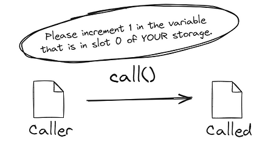
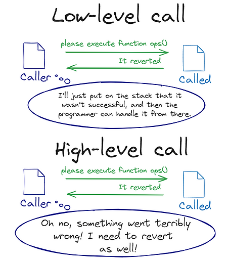
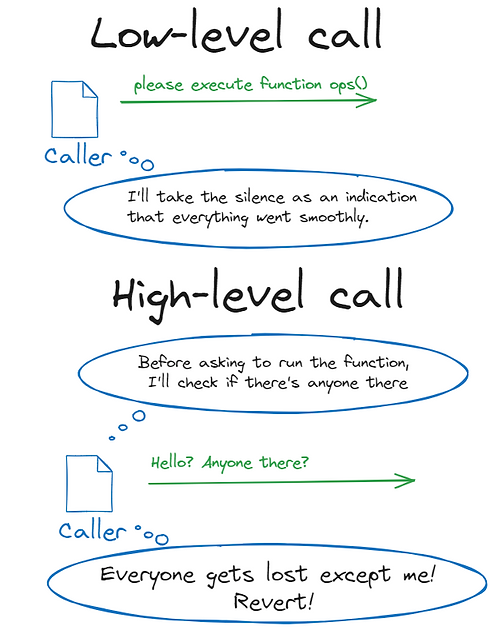

# [合约调用](https://www.rareskills.io/post/delegatecall)
## Call

- `call` 的外部调用在 `low-level` 层面新启一个 `EVM` 作为外部合约被 `call` 后的交易的执行环境
- 在新启的 `EVM` 执行环境中，整体复制外部合约的代码
  - 按照外部合约的逻辑执行当前交易，更新外部合约的状态变量
- 对于外部合约来讲，当前被 `call` 的交易处在新的 `EVM` 执行环境，交易的发起方就是发起调用的合约地址
## High-level
### contract interface
- 通过函数接口调用外部合约函数，<kbd>_Name(_Address).func()</kbd>
- `call` 返回 `(bool success, bytes memory data)`
  - 通过函数直接调用的话，`Solidity` 在语言层面直接判断返回值
  - 返回值如果为 `false` ,抛出 `revert()` 异常
    - 通过 [try/catch](../milestone_2/errors-check.md)捕获异常
## Low-level
### function selector
- 外部函数支持通过合约函数选择器传参调用， `abi.encodeWithSignature | encodeWithSelector | encodePacked`
  - `public|external` 修饰的函数允许外部调用 以及 继承的合约使用
  - `internal|private` 修饰的函数不支持外部调用
    - `internal` 修饰的函数允许继承使用
    - `private` 修饰的函数不允许继承使用
- 外部调用返回 `(bool success, bytes memory data)`
  - `boolean` 表明当前调用是否成功
  - `data` 是执行函数返回的数据
  - `call` 执行失败的话，不会 `revert` 回滚交易，因此需要执行异常判断
- `call` 外部合约不存在的函数
  - 外部合约存在缺省 `fallback()` ，就执行 `fallback()` 逻辑
  - 不存在缺省函数的话，直接返回 `false`



### Call types validation
- `call`
  - 交易执行在新的 `EVM` 执行环境
  - `address(this)` = 被调用的外部合约的地址
  
Solidity Examples
```solidity
// SPDX-License-Identifier: MIT
pragma solidity ^0.8.26;

contract Caller {
  // first call to ops()
  // just return false, but not revert
  function callByCall(address _address) public returns (bool) {
    (bool success, bytes memory returndata) = _address.call(
      abi.encodeWithSignature("ops()")
    );
    if (!success) _revert(returndata, "Call_Faliure");
    return success;
  }

  // second call to ops()
  // it will revert()
  function callByInterface(address _address) public {
    Called called = Called(_address);
    called.ops();
  }

  function _revert(bytes memory returndata, string memory errorMessage)
  private
  pure
  {
    // Look for revert reason and bubble it up if present
    if (returndata.length > 0) {
      // The easiest way to bubble the revert reason is using memory via assembly
      /// @solidity memory-safe-assembly
      assembly {
        let returndata_size := mload(returndata)
        revert(add(32, returndata), returndata_size)
      }
    } else {
      revert(errorMessage);
    }
  }
}

contract Called {
  // ops() always reverts
  function ops() public {
    revert();
  }
}
```
## Calling address(0)
### High-level
- [high-level](https://www.rareskills.io/post/low-level-call-solidity) 在 `solidity` 层面直接发起外部合约调用
  - 在发起对地址的调用前先校验 `caller` 是否合法
    - 只能对合约代码不为空的地址发起外部调用
### Lower-level
- `lower-level` 在 `EVM` 层面直接发起外部合约调用
  - 直接发起对地址的调用，不会在语言层面校验 `caller` 是否合法
  


## 外部调用 Error：
- 执行中遇到 `REVERT` 关键字
- `out-of-gas`
- 异常(`/0，out-of-bound`)

## Solidity Contracts
```solidity
// SPDX-License-Identifier: MIT
pragma solidity ^0.8.26;

interface ERC20 {
  function transferFrom(
    address from,
    address to,
    uint256 amount
  ) external returns (bool);
}

contract receiver {
  constructor() {}

  event ReceiveReceived(address Sender, uint256 Value);
  event FallbackReceived(address Sender, uint256 Value);

  receive() external payable {
    emit ReceiveReceived(msg.sender, msg.value);
  }

  fallback() external payable {
    emit FallbackReceived(msg.sender, msg.value);
  }
}

contract payer {
  constructor() payable {}

  function sendValue(address payable recipient, uint256 amount) external {
    bool success = recipient.send(amount); //ReceiveReceived
    if (!success) {
      revert("Send Trans Failure");
    }
  }

  function transferValue(address payable recipient, uint256 amount) external {
    recipient.transfer(amount); //ReceiveReceived
  }

  function callSendValue(
    address payable recipient,
    uint256 amount,
    bytes memory _data
  ) external {
    (bool success, ) = recipient.call{value: amount}(_data); //ReceiveReceived
    if (!success) {
      revert("call_send_value_failure");
    }
  }

  // 11053 gas cost
  function safeTransferNativeToken(
    address to,
    uint256 amount,
    uint256 txGas
  ) external {
    bool success;
    /// @solidity memory-safe-assembly
    assembly {
    // Transfer the ETH and store if it succeeded or not.
    //success := call(gas(), to, amount, 0, 0, 0, 0)
      success := call(txGas, to, amount, 0, 0, 0, 0)
    }
    require(success, "ETH_TRANSFER_FAILED");
  }

  function safeTransfer(
    ERC20 token,
    address to,
    uint256 amount
  ) internal {
    bool success;

    /// @solidity memory-safe-assembly
    assembly {
    // Get a pointer to some free memory.
      let freeMemoryPointer := mload(0x40)

    // Write the abi-encoded calldata into memory, beginning with the function selector.
      mstore(
        freeMemoryPointer,
        0xa9059cbb00000000000000000000000000000000000000000000000000000000
      )
      mstore(
        add(freeMemoryPointer, 4),
        and(to, 0xffffffffffffffffffffffffffffffffffffffff)
      ) // Append and mask the "to" argument.
      mstore(add(freeMemoryPointer, 36), amount) // Append the "amount" argument. Masking not required as it's a full 32 byte type.

      success := and(
      // Set success to whether the call reverted, if not we check it either
      // returned exactly 1 (can't just be non-zero data), or had no return data.
        or(
          and(eq(mload(0), 1), gt(returndatasize(), 31)),
          iszero(returndatasize())
        ),
      // We use 68 because the length of our calldata totals up like so: 4 + 32 * 2.
      // We use 0 and 32 to copy up to 32 bytes of return data into the scratch space.
      // Counterintuitively, this call must be positioned second to the or() call in the
      // surrounding and() call or else returndatasize() will be zero during the computation.
        call(gas(), token, 0, freeMemoryPointer, 68, 0, 32)
      )
    }

    require(success, "TRANSFER_FAILED");
  }
}
```
