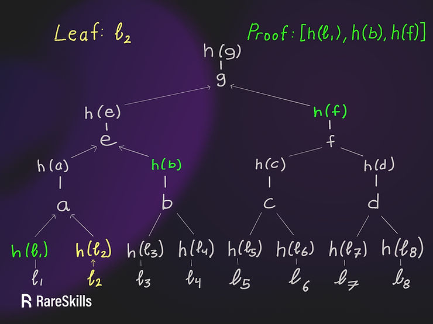
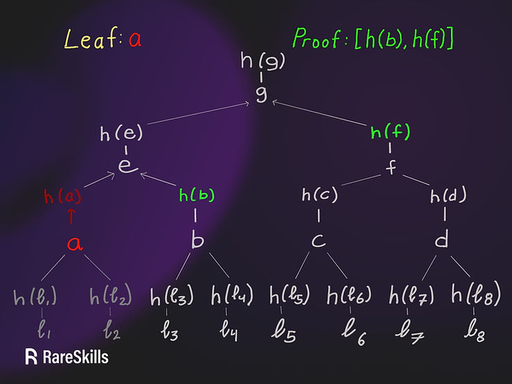
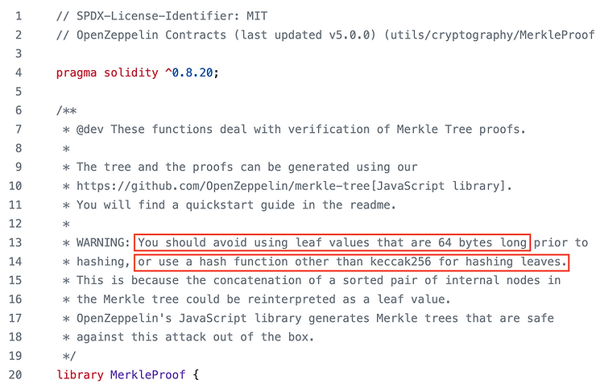

# MerkleProof

## 构建树
```text
h(a) = h(h(ℓ₁) + h(ℓ₂))
h(e) = h(h(a) + h(b))
h(g) = h(h(e) + h(f))
return root == h(g)
```


## Questions
### The attack requires 64 byte leaves
`MerkleTree` 只运算叶子节点数据的 `hash` ，上述构造树的过程中:
- 数据 `ℓ₁` 的 叶子节点数据 `h(ℓ₁) = 32 bytes`
- `a = h(ℓ₁) + h(ℓ₂) = 64 bytes`

1. `MerkleTree` 校验仅支持 `32bytes` 的叶子节点数据

> 校验过程中必须将提供的原值 hash 后参与计算
> 
> 因此，攻击者无法提供 a = 64 bytes 的原值，proof = [h(b), h(f)] 跳过校验
> 
> 如果 攻击者提供 h(a) 作为原址，原值再次 hash 后将不满足树的校验
> 
> 因此，32bytes 的叶子节点可以有效限制 攻击者跳过真实叶子节点的校验攻击问题

2. `MerkleTree` 校验如果支持 `64bytes` 的叶子节点数据

> 校验过程中必须将 提供的原值 hash 后参与计算
>
> 因此，攻击者可以提供 a = 64 bytes 的原值，proof = [h(b), h(f)] 跳过校验
> 
>  因此，64bytes 的叶子节点不能限制 攻击者跳过真实叶子节点的校验攻击问题，存在安全问题



### 叶子节点和父节点采用不同的hash运算
1. 再不限制叶子节点数据的前提下，可以通过采用不同的节点运算方式避免攻击问题
- 为简化使用，叶子节点执行双 `hash  h’(x) = h(h(x))`
- 父节点只进行单次 `hash` 参与构建
  - 此时，攻击者提供 `a` 值
  - 根据 `hash` 运算规则，`a` 执行 两次 `hash` 参与校验，此时不满足树的校验

## preference
[merkle-tree-second-preimage-attack](https://www.rareskills.io/post/merkle-tree-second-preimage-attack)

[openzeppelin-merkle-proof](https://github.com/OpenZeppelin/openzeppelin-contracts/blob/master/contracts/utils/cryptography/MerkleProof.sol)

[openzeppelin-merkle-proof-golang](https://github.com/FantasyJony/openzeppelin-merkle-tree-go)

[contracts](../ContractsHub/merkle_tree_prove/verify.sol)

