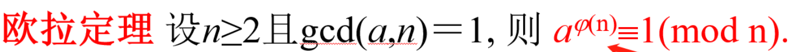
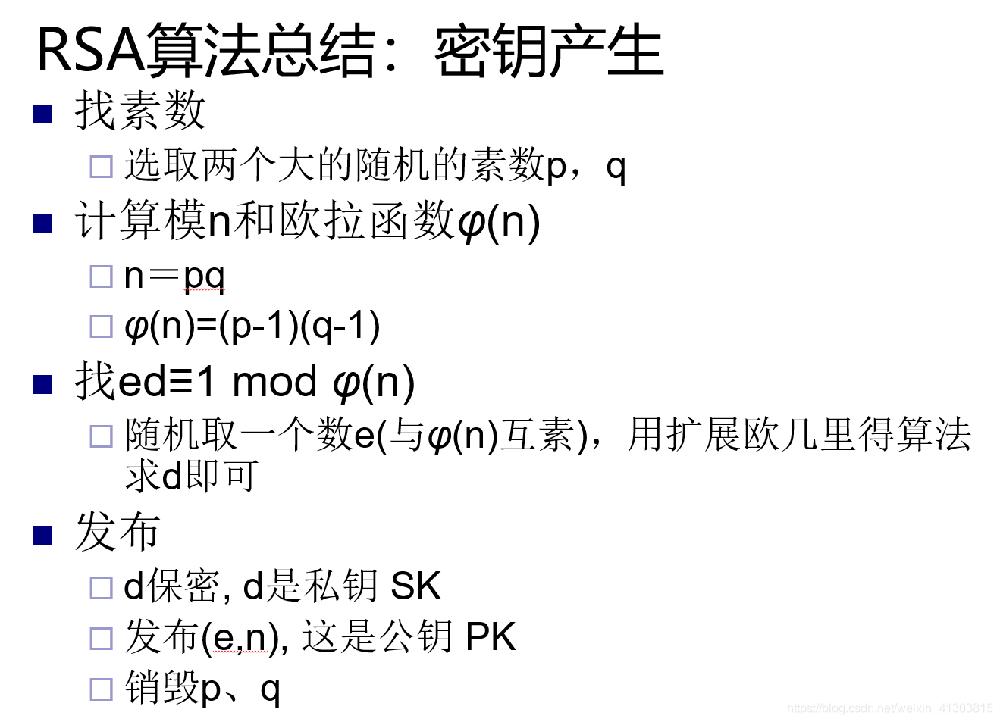
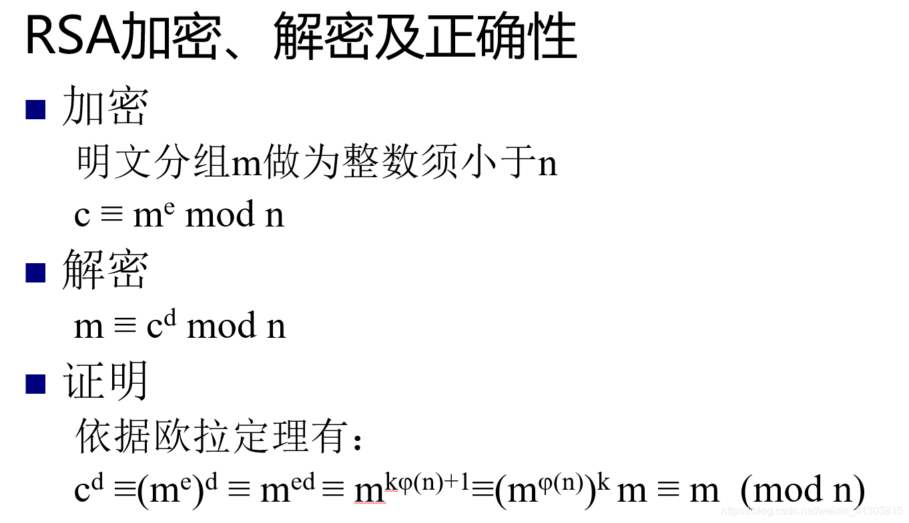
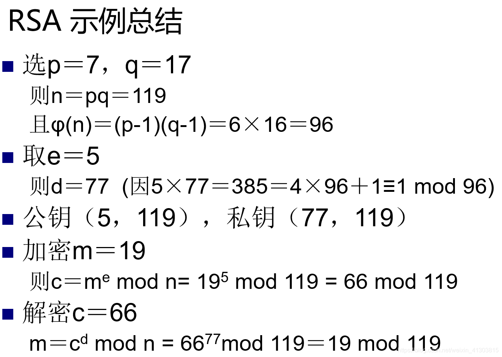

# 校验签名：
## [RSA](https://www.rareskills.io/post/solidity-rsa-signatures-for-aidrops-and-presales-beating-ecdsa-and-merkle-trees-in-gas-efficiency)
rsa非对称密钥体系 基于初等数论中的欧拉定理 并且建立在大整数因子分解的困难性问题上



加密/解密数据


examples


签名/解签
- 签名数据 m
- 签名数据 s = m^d % n
- 验证签名： s^e % n = m %n
  - s^e = m^(ed)
  - s = buyerAddress ^ d % n
  - msg.sender == s ^ e % n

## GasCost
### Math
Solidity Slot最多支持32 bytes(256bit),不能直接进行模幂运算，在 [EIP-198](https://eips.ethereum.org/EIPS/eip-198)增加 0x5 的预编译合约进行幂运算。
```solidity
    function modExp(
        uint256 base,
        uint256 exp,
        uint256 mod
    ) public view returns (uint256) {
        bytes memory precompileData = abi.encode(32, 32, 32, base, exp, mod);
        (bool ok, bytes memory data) = address(5).staticcall(precompileData);
        require(ok, "expMod failed");
        return abi.decode(data, (uint256));
    }
```
staticCall 调用预编译合约执行幂运算，需要从内存加载 base,exp,mod 参数
### Key
RSA 加密依赖大数分解，其中 RSA2048 表示的是大数 n 具有 2048bit, 因此每bit 位数每增加一位，公钥的安全性就成指数增长。

为保证安全，如果采用 RSA1024，需要1024bit存储 n 的值，在 solidity中需要 4个 slot 插槽，sload n值需要 4 * 2100 = 8400 gas.

如果使用 immutable| constant 参数将公钥编码进 codes，但是这样没办法取消签名（ECDSA通过更换签名地址，Merkle通过更新root值取消旧的校验数据），但是将数据存储叜 codes中远比从slot 读取数据更节省 gas
  - [extcodecopy](https://www.evm.codes/?fork=cancun#3c)读取codes的花销
  - ```text 
    minimum_word_size = (size + 31) / 32
    static_gas = 0
    dynamic_gas = 3 * minimum_word_size + memory_expansion_cost + address_access_cost
    ```
  - 如果后面更新签名数据，直接更换外部合约，重新部署合约代码，更新codes存储的 key
  - 通过 create2 可以部署相同的合约地址，因此在合约codes中分成两部分：
    - 第一部分执行 selfdestruct,然后在相同地址部署合约
    - 第二部分存储公钥 key,直接外部调用解码使用
#### warm access list
读取address数据时，将 code_access 的2600gas可以降低到 warm_access的100 gas

## [合约验证签名](https://github.com/RareSkills/RSA-presale-allowlist/blob/main/README.md)
```solidity
// SPDX-License-Identifier: MIT
pragma solidity ^0.8.26;


contract Rsa {
    event Metamorphosed(address metamorphicContract);

    address public immutable owner;

    address public immutable metamorphicContractAddress;

    bytes32 private immutable salt;

    uint256 private immutable modLength;

    bytes currentImplementationCode;

    bytes32 public constant EXPONENT =
    0x0000000000000000000000000000000000000000000000000000000000000003;

    /**
     * @dev See README.md for bytecode breakdown
     */
    bytes32 private immutable _metamorphicContractInitializationCode;

    //------------------------------------------------------------\\
    constructor(bytes32 _salt, uint256 _modLength) {
        owner = msg.sender;
        salt = _salt;
        modLength = _modLength;

        // contract runtime code length (without modulus) = 51 bytes (0x33)
        bytes memory metamorphicInit = (
            abi.encodePacked(
            hex"630000000e60005261",
            /**
             *   must be 0x40(pointer + bytes length) + contract code length  + modulus length
             *   fixed 2 bytes as no mod length over 2 bytes in size is expected
             *   rsa-2048 = 0x0100 2 bytes length
             */
            uint16(0x73 + _modLength),
            hex"60006004601c335afa61",
            /**
             *  contract code length + modulus length
             *  fixed 2 bytes
             */
            uint16(0x33 + _modLength),
            hex"6040f3"
        )
        );

        /**
         * @dev stackMetaInit is a temp variable used to parse the length of the
         *      metamorphic init code from the actual code. The is required as
         *      'bytes memory metamorphicInit' has a dynamic length and will
         *      prepend the value with it's length.
         *
         *      It is parsed in assembly and then set outside the block as
         *      assembly access to immutable variables is not supported.
         */
        bytes32 stackMetaInit;
        assembly {
        // use assembly to prune bytes to just get the bytes data
            stackMetaInit := mload(add(metamorphicInit, 0x20))
        }
        _metamorphicContractInitializationCode = stackMetaInit;

        // Hash of metamorphic bytecode.
        bytes32 METAMORPHIC_INIT_HASH = keccak256(
            abi.encodePacked(stackMetaInit)
        );

        // Calculate and store as immutable, metamorphic contract address.
        metamorphicContractAddress = (
            address(
            uint160(
                uint256(
                    keccak256(
                        abi.encodePacked(
                            hex"ff",
                            address(this),
                            _salt,
                            METAMORPHIC_INIT_HASH
                        )
                    )
                )
            )
        )
        );
    }

    /**
     * @notice 'verifySignature' is the user facing function used to validate
     *          signed messages.
     *
     * @param  'sig' length must always be equal to the length of the public
     *          key(modulus).
     *
     * @dev     Exponent is hardcoded at top of contract. This may be altered
     *          for specific use cases but it must always be 32 bytes.
     *
     * @dev See below layout & link for memory when calling precompiled modular exponentiation contract (0x05)
     *      <length_of_BASE(signature)> <length_of_EXPONENT> <length_of_MODULUS> <BASE(signature)> <EXPONENT> <MODULUS>
     *
     *      https://github.com/ethereum/EIPs/blob/master/EIPS/eip-198.md
     */
    function verifySignature(bytes calldata sig) external view returns (bool) {
        require(sig.length == modLength);

        // Load immutable variable onto the stack.
        address _metamorphicContractAddress = metamorphicContractAddress;

        // no need to update pointer as all memory written here can be overwriten with no consequence
        assembly {
        /**
         * @dev No need to update free memory pointer as all memory written here
             *      can be overwriten with no consequence.
             *
             * @dev Store in memory, length of BASE(signature), EXPONENT, MODULUS.
             */
            mstore(0x80, sig.length)
            mstore(add(0x80, 0x20), 0x20)
            mstore(add(0x80, 0x40), sig.length)

        // Store in memory, BASE(signature), EXPONENT, MODULUS(public key).
            calldatacopy(0xe0, sig.offset, sig.length)
            mstore(add(0xe0, sig.length), EXPONENT)

        /**
         * @dev Calculate where in memory to copy modulus to (modPos). This must
             *      be dynamically determined as various size of signature may be used.
             */
            let modPos := add(0xe0, add(sig.length, 0x20))

        /**
         * @dev 0x33 is a precalulated value that is the offset of where the
             *      signature begins in the metamorphic bytecode.
             */
            extcodecopy(_metamorphicContractAddress, modPos, 0x33, sig.length)

        /**
         * @dev callDataSize must be dynamically calculated. It follows the
             *      previously mentioned memory layout including the length and
             *      value of the sig, exponent and modulus.
             */
            let callDataSize := add(0x80, mul(sig.length, 2))

        /**
         * @dev Call 0x05 precompile (modular exponentation) w/ the following
             *      args and revert on failure.
             *
             *      Args:
             *      gas,
             *      precomipled contract address,
             *      memory pointer of begin of calldata,
             *      size of call data (callDataSize),
             *      pointer for where to copy return,
             *      size of return data
             */
            if iszero(
                staticcall(gas(), 0x05, 0x80, callDataSize, 0x80, sig.length)
            ) {
                revert(0, 0)
            }


        /**
         * @dev Check all leading 32-byte chunk to ensure values are zeroed out.
             *      If a valid sig then only the last 20 bytes will contains non-zero bits.
             */
            let chunksToCheck := div(sig.length, 0x20)
            for { let i := 1 } lt(i, chunksToCheck) { i := add(i, 1) }
            {
                if  mload(add(0x60, mul(i, 0x20)))
                {
                    revert(0, 0)
                }
            }

        /**
         * @dev Decoded signature will always be contained in last 32-bytes.
             *      If msg.sender == decoded signature then return true, else false.
             */
            let decodedSig := mload(add(0x60, sig.length))
            if eq(caller(), decodedSig) {
            // Return true
                mstore(0x00, 0x01)
                return(0x00, 0x20)
            }
        // Else Return false
            mstore(0x00, 0x00)
            return(0x00, 0x20)
        }
    }

    modifier onlyOwner() {
        require(owner == msg.sender);
        _;
    }

    /**
     * @notice 'deployPublicKey' is used in initializing the metamorphic contract that
     *          stores the RSA modulus, n (public key).
     *
     * @dev     See Repo README for guide to generating public key via python script.
     *
     * https://github.com/RareSkills/RSA-presale-allowlist
     */
    function deployPublicKey(bytes calldata publicKey) external onlyOwner {
        require(publicKey.length == modLength, "incorrect publicKey length");

        // contract runtime code length (without modulus) = 51 bytes (0x33)
        bytes memory contractCode = abi.encodePacked(
            hex"3373",
            address(this),
            hex"14601b57fe5b73",
            address(this),
            hex"fffe",
            publicKey
        );

        // Code to be returned from metamorphic init callback. See README for explanation.
        currentImplementationCode = contractCode;

        // Load immutable variables onto the stack.
        bytes32 metaMorphicInitCode = _metamorphicContractInitializationCode;
        bytes32 _salt = salt;

        // Address metamorphic contract will be deployed to.
        address deployedMetamorphicContract;

        assembly {
        /**
         * Store metamorphic init code in scratch memory space.
         * This is previously dynamically created in constructor (based on public key size
         * and stored as an immutable variable.
         */
            mstore(0x00, metaMorphicInitCode)

        /**
         * CREATE2 args:
         *  value: value in wei to send to the new account,
         *  offset: byte offset in the memory in bytes, the initialisation code of the new account,
         *  size: byte size to copy (size of the initialisation code),
         *  salt: 32-byte value used to create the new contract at a deterministic address
         */
            deployedMetamorphicContract := create2(
                0,
                0x00,
                0x20, // as init code is stored as bytes32
                _salt
            )
        }

        // Ensure metamorphic deployment to address as calculated in constructor.
        require(
            deployedMetamorphicContract == metamorphicContractAddress,
            "Failed to deploy the new metamorphic contract."
        );

        emit Metamorphosed(deployedMetamorphicContract);
    }

    /**
     * @notice 'destroyContract' must be called before redeployment of public
     *          key contract.
     *
     * @dev     See Repo README.md process walk-through.
     *
     * https://github.com/RareSkills/RSA-presale-allowlist
     */
    function destroyContract() external onlyOwner {
        (bool success, ) = metamorphicContractAddress.call("");
        require(success);
    }

    /**
     * @notice 'callback19F236F3' is a critical step in the initialization of a
     *          metamorphic contract.
     *
     * @dev     The function selector for this is '0x0000000e'
     */
    function callback19F236F3() external view returns (bytes memory) {
        return currentImplementationCode;
    }
}
```
